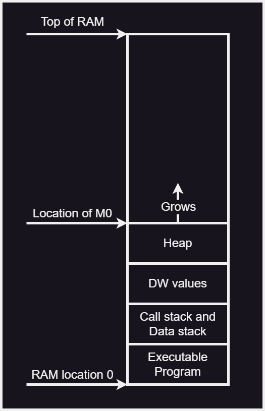



# **URCL UNNAMED BETA**
**OFFICIAL DOCUMENTATION**

**Written by Ben Aitken (Mod Punchtree) – 17th Nov 2023**

# **ABSTRACT**
|![Tip icon]|*URCL stands for: Universal Reduced Computer Language*|
| - | - |

URCL is a simple universal intermediate language. It is designed to be as similar as possible to common RISC assembly in order to make it as easy as possible to translate to any specific assembly language. This documentation will go into greater depth than the old Google Sheet documentation.

# **CONTENTS**
* [Abstract](#abstract)
* [Contents](#contents)
* [Introduction](#introduction)
    * [Links](#links)
* [Overview](#overview)
    * [Source Files](#source-files)
        * [URCL Source Files](#urcl-source-files)
    * [General Syntax](#general-syntax)
        * [General Layout](#general-layout)
        * [Prefixes](#prefixes)
        * [Comments](#comments)
        * [Macros](#macros)
        * [Numbers](#numbers)
        * [Relative Numbers](#relative-numbers-1)
        * [Floating Point Numbers](#floating-point-numbers)
        * [Defined Immediate Values](#defined-immediate-values)
        * [ASCII Characters](#ascii-characters)
        * [Whitespace](#whitespace)
    * [Zero Register](#zero-register)
    * [Headers](#headers)
        * [CPU Word Length](#cpu-word-length)
        * [Minimum Number of Registers](#minimum-number-of-registers)
        * [Minimum Heap Space](#minimum-heap-space)
        * [Minimum Call Stack Size](#minimum-call-stack-size)
        * [Minimum Data Stack Size](#minimum-data-stack-size)
    * [Define Words](#define-words)
        * [Define Word Definition](#define-word-definition)
        * [Define Word Usage](#define-word-usage)
        * [ROM Word](#rom-word)
    * [Labels](#labels)
        * [Label Definition](#label-definition)
        * [Label Usage](#label-usage)
    * [Memory Map](#memory-map)
        * [Heap](#heap)
        * [Call Stack](#call-stack)
        * [Data Stack](#data-stack)
* [Instructions](#instructions)
    * [Core Instructions](#core-instructions)
        * [ADD (Core)](#add-core)
        * [RSH (Core)](#rsh-core)
        * [LOD (Core)](#lod-core)
        * [STR (Core)](#str-core)
        * [BGE (Core)](#bge-core)
        * [NOR (Core)](#nor-core)
        * [IMM (Core)](#imm-core)
        * [PSH (Core)](#psh-core)
        * [POP (Core)](#pop-core)
        * [CAL (Core)](#cal-core)
        * [RET (Core)](#ret-core)
    * [Basic Instructions](#basic-instructions)
        * [ADD (Basic)](#add-basic)
        * [RSH (Basic)](#rsh-basic)
        * [LOD (Basic)](#lod-basic)
        * [STR (Basic)](#str-basic)
        * [BGE (Basic)](#bge-basic)
        * [NOR (Basic)](#nor-basic)
        * [SUB](#sub)
        * [JMP](#jmp)
        * [MOV](#mov)
        * [NOP](#nop)
        * [IMM (Basic)](#imm-basic)
        * [LSH](#lsh)
        * [INC](#inc)
        * [DEC](#dec)
        * [NEG](#neg)
        * [AND](#and)
        * [OR](#or)
        * [NOT](#not)
        * [XNOR](#xnor)
        * [XOR](#xor)
        * [NAND](#nand)
        * [BRL](#brl)
        * [BRG](#brg)
        * [BRE](#bre)
        * [BNE](#bne)
        * [BOD](#bod)
        * [BEV](#bev)
        * [BLE](#ble)
        * [BRZ](#brz)
        * [BNZ](#bnz)
        * [BRN](#brn)
        * [BRP](#brp)
        * [PSH (Basic)](#psh-basic)
        * [POP (Basic)](#pop-basic)
        * [CAL (Basic)](#cal-basic)
        * [RET (Basic)](#ret-basic)
        * [HLT](#hlt)
        * [CPY](#cpy)
        * [BRC](#brc)
        * [BNC](#bnc)
    * [Complex Instructions](#complex-instructions)
        * [MLT](#mlt)
        * [DIV](#div)
        * [MOD](#mod)
        * [BSR](#bsr)
        * [BSL](#bsl)
        * [SRS](#srs)
        * [BSS](#bss)
        * [SETE](#sete)
        * [SETNE](#setne)
        * [SETG](#setg)
        * [SETL](#setl)
        * [SETGE](#setge)
        * [SETLE](#setle)
        * [SETC](#setc)
        * [SETNC](#setnc)
        * [LLOD](#llod)
        * [LSTR](#lstr)
        * [SDIV](#sdiv)
        * [SBRL](#sbrl)
        * [SBRG](#sbrg)
        * [SBLE](#sble)
        * [SBGE](#sbge)
        * [SSETL](#ssetl)
        * [SSETG](#ssetg)
        * [SSETLE](#ssetle)
        * [SSETGE](#ssetge)
        * [ABS](#abs)
        * [MEMCPY](#memcpy)
    * [Untranslatable Instructions](#untranslatable-instructions)
        * [IN](#in)
        * [OUT](#out)
        * [ITOF](#itof)
        * [FTOI](#ftoi)
        * [FRTOI](#frtoi)
        * [FADD](#fadd)
        * [FSUB](#fsub)
        * [FMLT](#fmlt)
        * [FDIV](#fdiv)
        * [FSQRT](#fsqrt)
        * [FABS](#fabs)
* [Instruction Translations](#instruction-translations)
    * [Basic Instruction Translations](#basic-instruction-translations)
        * [ADD](#add)
        * [RSH](#rsh)
        * [LOD](#lod)
        * [STR](#str)
        * [BGE](#bge)
        * [NOR](#nor)
        * [SUB](#sub-1)
        * [JMP](#jmp-1)
        * [MOV](#mov-1)
        * [NOP](#nop-1)
        * [IMM](#imm)
        * [LSH](#lsh-1)
        * [INC](#inc-1)
        * [DEC](#dec-1)
        * [NEG](#neg-1)
        * [AND](#and-1)
        * [OR](#or-1)
        * [NOT](#not-1)
        * [XNOR](#xnor-1)
        * [XOR](#xor-1)
        * [NAND](#nand-1)
        * [BRL](#brl-1)
        * [BRG](#brg-1)
        * [BRE](#bre-1)
        * [BNE](#bne-1)
        * [BOD](#bod-1)
        * [BEV](#bev-1)
        * [BLE](#ble-1)
        * [BRZ](#brz-1)
        * [BNZ](#bnz-1)
        * [BRN](#brn-1)
        * [BRP](#brp-1)
        * [HLT](#hlt-1)
        * [CPY](#cpy-1)
        * [BRC](#brc-1)
        * [BNC](#bnc-1)
    * [Complex Instruction Translations](#complex-instruction-translations)
        * [MLT](#mlt-1)
        * [DIV](#div-1)
        * [MOD](#mod-1)
        * [BSR](#bsr-1)
        * [BSL](#bsl-1)
        * [SRS](#srs-1)
        * [BSS](#bss-1)
        * [SETE](#sete-1)
        * [SETNE](#setne-1)
        * [SETG](#setg-1)
        * [SETL](#setl-1)
        * [SETGE](#setge-1)
        * [SETLE](#setle-1)
        * [SETC](#setc-1)
        * [SETNC](#setnc-1)
        * [LLOD](#llod-1)
        * [LSTR](#lstr-1)
        * [SDIV](#sdiv-1)
        * [SBRL](#sbrl-1)
        * [SBRG](#sbrg-1)
        * [SBLE](#sble-1)
        * [SBGE](#sbge-1)
        * [SSETL](#ssetl-1)
        * [SSETG](#ssetg-1)
        * [SSETLE](#ssetle-1)
        * [SSETGE](#ssetge-1)
        * [ABS](#abs-1)
        * [MEMCPY](#memcpy-1)
* [Ports](#ports-1)
* [Code Faults](#code-faults)
    * [Pre-Runtime Faults](#pre-runtime-faults)
        * [Invalid Number of Operands](#invalid-number-of-operands)
        * [Invalid Operand Types](#invalid-operand-types)
        * [Unrecognised Identifier](#unrecognised-identifier)
        * [Unsupported Number of Registers](#unsupported-number-of-registers)
        * [Unsupported Heap Size](#unsupported-heap-size)
        * [Unsupported Call Stack Size](#unsupported-call-stack-size)
        * [Unsupported Data Stack Size](#unsupported-data-stack-size)
        * [Invalid Label Name](#invalid-label-name)
        * [Duplicate Label Definition](#duplicate-label-definition)
    * [Runtime Faults](#runtime-faults)
        * [Non-Instruction Execution](#non-instruction-execution)
        * [Call Stack Underflow](#call-stack-underflow)
        * [Data Stack Underflow](#data-stack-underflow)
        * [Call Stack Overflow](#call-stack-overflow)
        * [Data Stack Overflow](#data-stack-overflow)
        * [Invalid RAM Location](#invalid-ram-location)
* [Interpreting URCL](#interpreting-urcl)
    * [Bitwise Representation](#bitwise-representation)
* [Example Programs](#example-programs)
    * [Simple Fibonacci](#simple-fibonacci)
    * [FizzBuzz](#fizzbuzz)
    * [Bubble Sort](#bubble-sort)
* [Acknowledgements](#acknowledgements)
    * [Biggest Contributors](#biggest-contributors)

# **INTRODUCTION**
URCL first started with Minecraft CPUs and has also been called Universal Redstone Computer Language. However, applications for URCL are not limited to only Minecraft, as it can be applied to a wide range of CPUs with any ISA (Instruction Set Architecture).

CPUs which are compatible with URCL can make use of the tools built for URCL. These tools include emulators and high-level language compilers. Programs which are written in URCL can also be shared between any other URCL compatible CPU regardless of the ISAs of the CPUs.
## **Links**
**URCL Official Documentation Repository:**

<https://github.com/ModPunchtree/URCL>

|![Tip icon]|*Go here to find the most up to date version of the official URCL documentation.*|
| - | - |

**URCL Discord:**  
<https://discord.gg/Nv8jzWg5j8>

**URCX Emulator:**  
<https://github.com/BramOtte/urcl-explorer>

|![Tip icon]|*This is a URCL emulator that runs directly in the browser.*|
| - | - |

# **OVERVIEW**
## **Source Files**
### ***URCL Source Files***
All URCL code should be contained in “.urcl” files. These are plain text files. The name of the file can be any string of letters, numbers, and underscore.

|![Tip icon]|*To edit URCL code it is recommended that VSCode is used along with the “URCL & B Syntax Highlighter” extension by RedCMD on the VSCode marketplace.*|
| - | - |

|![Tip icon]|*To directly emulate URCL code it is recommended that the URCX Emulator by Bram is used.* *URCX can be found here: [https://github.com/BramOtte/urcl-explorer](https://github.com/BramOtte/urcl-explorer)* *Or it can be accessed using the URCX discord bot in the #urcl-bot channel in the URCL Discord server.*|
| - | - |

## **General Syntax**
### ***General Layout***
All URCL instructions contain an Identifier as well as Sources and a Destination. The Identifier is simply the name of the instruction. Sources specify where data should be fetched from, and the Destination specifies where the result of the instruction should be written to.

URCL instructions generally follow a three operand format. This means that there are three or fewer operands in each instruction.

In written form, the instructions take the format:

    Identifier Destination Source1 Source2

For example:

    ADD R1 R2 R3

|![Tip icon]|*Add the contents of register 2 to the contents of register 3. Then write result into register 1.*|
| - | - |

All URCL instructions are atomic and are fully self-contained.

Atomic means that instructions are executed one at a time sequentially, and the next instruction does not start until the previous has finished.

Self-contained means that each instruction can be executed without any external information outside of the sources specified by the instruction itself. This means that the exact same instruction will always do the exact same thing regardless of the current state of the CPU.

URCL instructions are designed to be translated one at a time into the target CPU’s assembly.

This means that any URCL program can be translated easily, provided each instruction has an equivalent translation on the target CPU.

|![Tip icon]|*URCL uses a load-store architecture.* *Which means that values must be loaded from the RAM into the registers in order to be used. Then the results may be stored back into the RAM.*|
| - | - |

### ***Prefixes***
There are prefixes for general purpose registers, memory, labels, relative numbers, and ports.

#### *Registers*
Registers are prefixed with either `R` or `$`.

For example:  
`R1` or `$1` refer to general purpose register 1.

#### *Memory*
Memory locations are prefixed with either `M` or `#`.

For example:  
`M0` or `#0` refer to memory location 0.

|![Tip icon]|*Note that “memory” here does not refer to the entire RAM space, it only refers to the Heap which is later described in the Memory Map section.*|
| - | - |

|![Tip icon]|*If memory locations are used in an instruction which is not LOD, STR, LLOD or LSTR then it gets translated to an immediate value which points to that memory location.*|
| - | - |

#### *Labels*
Labels are prefixed with **`.`**.

For example:  
`.test` refers to the label called “test”.

#### *Relative Numbers*
Relative Numbers are prefixed with `~+` or `~-`.

For example:  
`~+2` is a relative number that is positive 2.

#### *Ports*
Ports are prefixed with `%`. For example:

`%TEXT` refers to a port called “TEXT”

### ***Comments***
Comments in URCL are the same as comments in C. Line comments are denoted using `//`. Multi-line comments are denoted using `/*` and `*/`.

For example:

    // this comment is a line comment.

    /*
    this comment
    is a multi-line
    comment.
    */

### ***Macros***
All macros are prepended with `@`.

For example:

    @DEFINE TEST 2

|![Tip icon]|*Individual macros are not defined in URCL as they are completely up to the particular URCL interpreter to define. This is to enable different interpreters to define macros to suit their own needs.*|
| - | - |

### ***Numbers***
Numbers that have no prefix are in base 10, such as a number used as an immediate value. For example:

`IMM R1 5` in this example the `5` is being used as an immediate value and it has no prefix so it will be interpreted as being in base 10.

Base 16 and base 2 numbers can also be used but they must be prepended with 0x and 0b respectively. For example:

`IMM R1 0x5` the `0x5` will be interpreted as a base 16 value.

`IMM R1 0b101` the `0b101` will be interpreted as a base 2 value.

|![Tip icon]|*The example instruction in the previous 3 examples all load an immediate value of 5, into register 1.*|
| - | - |

Base 8 numbers are prefixed with 0o. Numbers that are prefixed with 0 will be treated as base 10 numbers.

|![Tip icon]|*Base 8 numbers are rarely used, so check they are supported by the target before using them.*|
| - | - |

### ***Relative Numbers***
Relative numbers are used to specify the address of an instruction, relative to the current instruction. These are values are prefixed with a `~+` or a `~-`. For example:

`JMP ~+5` the `~+5` refers to the URCL instruction 5 ahead of the current instruction.

|![Tip icon]|*A relative value of `~+0` or `~-0` refers to the address of the current instruction.*|
| - | - |

|![Tip icon]|*Relative values must be converted into labels before being translated.*|
| - | - |

### ***Floating Point Numbers***
All numbers that contain a radix point are treated as floating point numbers.

For example:  
`6.9` or `-3.14` or `+7.5` or `0xA.B`

Floating point numbers can be positive or negative using a `+` or `-` prefix. The absence of either prefix means the number is positive.

|![Tip icon]|*0xA.B is the equivalent of 10.6875 in base 10 The absence of the base prefix on a number means it is base 10.*|
| - | - |

The exact floating point format used by the target CPU is not defined by the URCL documentation. This means the target CPU may choose to use whatever format it wants.

|![Tip icon]|*Simpler target CPUs might not support any kind of floating point format. Do not use floating point numbers in a URCL program if the target CPU cannot handle them.*|
| - | - |

Since the floating point format is entirely up to the target CPU - the range and accuracy of the floating point values will vary between different target CPUs. Beware that this may cause the exact same program to behave a little differently on different target CPUs.

|![Tip icon]|*The definition of floating points is purposely kept vague so that target CPUs can handle them in a way that is most optimal for them. Target CPUs with different word sizes and different floating point hardware will likely handle the same floating point values in a URCL program differently.*|
| - | - |

|![Tip icon]|*Beware that different target CPUs may handle floating point calculation errors (such as division by zero or negative square root) differently.*|
| - | - |

### ***Defined Immediate Values***
Defined immediate values are values which are directly translated into an immediate value before translating the URCL code into the target assembly. All defined immediate values are prepended with a `@`.

The following table contains all the defined immediate values:

|**Defined Immediate Value**|**Full Name**|**Value**|
| :-: | :-: | :-: |
|`@BITS`|Bits|Equal to the value of the BITS header|
|`@MINREG`|Minimum registers|Equal to the value of the MINREG header|
|`@MINHEAP`|Minimum heap|Equal to the value of the MINHEAP header|
|`@MINCALLSTACK`|Minimum Call Stack|Equal to the value of the MINCALLSTACK header|
|`@MINDATASTACK`|Bits|Equal to the value of the MINDATASTACK header|
|`@CALLSTACK`|Bits|Equal to the actual size of the call stack in words (this is specific to the target CPU instead of the URCL program)|
|`@DATASTACK`|Bits|Equal to the actual size of the data stack in words (this is specific to the target CPU instead of the URCL program)|
|`@HEAP`|Heap|Equal to the actual size of the heap on the target in words (this is specific to the target CPU instead of the URCL program)|
|`@MSB`|Most significant bit|Equal to a binary value with only the most significant bit active (128 in an 8 bit program)|
|`@SMSB`|Signed most significant bit|Equal to a binary value with only the second most significant bit active (64 in an 8 bit program)|
|`@MAX`|Maximum|Equal to a binary value with all bits active (255 in an 8 bit program)|
|`@SMAX`|Signed maximum|Equal to a binary value with all bits active except the most significant bit (127 in an 8 bit program)|
|`@UHALF`|Upper half|Equal to a binary value with all bits greater than or equal to 2BITS2 active (240 in an 8 bit program)|
|`@LHALF`|Lower half|Equal to a binary value with all bits less than 2BITS2 active (15 in an 8 bit program)|

|![Tip icon]|*For odd number bit widths, the Lower half will contain the middle bit and the Upper half will not.*|
| - | - |

### ***ASCII Characters***
ASCII Characters In the code must enclosed using `'`. These characters are directly translated into an immediate value (based on 7 bit ASCII) before being translated from URCL code into the target assembly.

For example:  
`'C'` would become an immediate value of 67.  
`'5'` would become an immediate value of 53.

When translating characters into immediate values, refer to:  
<https://montcs.bloomu.edu/Information/Encodings/ascii-7.html>

### ***Whitespace***
All groups of spaces in URCL are treated as a single space. This means that multiple spaces can be used, and code can be indented however much the programmer wants while still being valid.

However, newlines are important as these mark where one instruction ends and the next begins. This means that multiple instructions cannot be put on the same line. Empty lines will be ignored though, meaning the programmer can have as many empty lines in between their instructions as they like.

|![Tip icon]|*The whitespace should be used to make the code as legible as possible.*|
| - | - |

## **Zero Register**
The zero register is a register that cannot be overwritten and always reads 0. The zero register is referred to in the same way as any other general purpose register. So, `R0` and `$0` both refer to register zero.

If the zero register is specified as a source operand to in an instruction, then it is the same as using an immediate value of zero.

If the zero register is specified as the destination operand in an instruction, then the output of the instruction is simply discarded.

|![Tip icon]|*In most circumstances it is advisable that the zero register is never used as a destination as this is the same as doing nothing in most instructions.*|
| - | - |

## **Headers**
Headers contain information which tells the URCL interpreter the required specific parameters for running a program. The headers can also allow you to see if a program is compatible with a target CPU.

### ***CPU Word Length***
URCL assumes that the target CPU uses the same word length for everything. This means that an 8 bit CPU can have a maximum of 256 memory locations, 256 general purpose registers and any value larger than 8 bits in the code would be truncated to make it 8 bits.

The word length is specified on a per-program basis, this means that every URCL program must specify the word length it runs at. This is done using the `BITS` header. For example:

`BITS == 8` this specifies that the word length must be exactly 8 bits for this program.

`BITS >= 8` this specifies that the word length can be 8 or more bits.

`BITS <= 8` this specifies that the word length can be 8 or fewer bits.

|![Tip icon]|*Most programs will only run at a single word length, so >= and <= are rarely used outside of libraries.*|
| - | - |

|![Tip icon]|*If the BITS header is missing, then the program should be assumed to be 8 bit.*|
| - | - |

|![Tip icon]|*If the BITS header is missing the “==” or “>=” or “<=” then it is assumed to be “==”.* *So “BITS 8” is the same as “BITS == 8”.*|
| - | - |

### ***Minimum Number of Registers***
The number of registers that can be used in URCL is fixed and each program needs to specify the minimum number of general purpose registers it requires. This is done using the MINREG header. 

For example:  
`MINREG 4` this specifies that this program requires a minimum of 4 general purpose registers which means that any CPU at least 4 general purpose registers can run the program (provided it meets all other requirements).

|![Tip icon]|*If the MINREG header is missing, then the assumed value is 8.*|
| - | - |

### ***Minimum Heap Space***
The minimum number of words of heap space a program needs is specified using the `MINHEAP` header.

For example:  
`MINHEAP 16` this specifies that this program needs 16 words of heap space to run.

|![Tip icon]|*Note that the Heap does not refer to the entire RAM space. The Heap is described in more detail in the Memory Map section.*|
| - | - |

|![Tip icon]|*If the MINHEAP header is missing, then the assumed value is 16.*|
| - | - |

### ***Minimum Call Stack Size***
Programs can specify the minimum number of words that the call stack must be able to hold in order to run a program. This is done using the `MINCALLSTACK` header.

For example:  
`MINCALLSTACK 32` specifies that the call stack must be able to hold at least 32 values to run this program.

|![Tip icon]|*If the MINCALLSTACK header is missing, then the assumed value is 8.*|
| - | - |

### ***Minimum Data Stack Size***
Programs can specify the minimum number of words that the data stack must be able to hold in order to run a program. This is done using the `MINDATASTACK` header.

For example:  
`MINDATASTACK 32` specifies that the data stack must be able to hold at least 32 values to run this program.

|![Tip icon]|*If the MINDATASTACK header is missing, then the assumed value is 8.*|
| - | - |

|![Tip icon]|*Headers can be located anywhere within a URCL program, but they should be at the very top to make it clearer to anyone reading the code.*|
| - | - |

## **Define Words**
Define words are predefined values that exist inside of the RAM space where the URCL program is stored. These values can freely be read and written to in the same way as any other value in the heap.

These are useful for storing predefined arrays, strings, or lookup tables within a URCL program.

### ***Define Word Definition***
Defined words are created by writing `DW` followed by a value. The value must be able to fit in a single word (so, the value must be between 0 and 255 in an 8 bit program).

For example:

    DW 0x45

This defines a value of “0x45” directly inside of the RAM which the URCL program can use.

Arrays of values can also be defined by writing `DW` followed by an array of values enclosed with square braces `[` and `]`.

For example:

    DW [0 1 2 3]

This defines 4 sequential values. The first is 0, the second is 1, the third is 2 and the final value is 3.

The above example is identical to:

    DW 0
    DW 1
    DW 2
    DW 3

Where each value inside of the array is a single, separate defined value.

|![Tip icon]|*Note that the order the values in the array are defined, starts with the first item in the array. The order must not be changed when translating to the target.*|
| - | - |

|![Tip icon]|*Defined values that are in series (such as an array) must be stored in adjacent RAM address values in the target CPU. This is so that any value in the array can be accessed by adding its index to the address of the first value.*|
| - | - |

### ***Define Word Usage***
Defined words can be pointed to using relative values or labels.

For example:

    .test2
        DW 0x45

The label “test2” points to the defined value of “0x45”.

Values inside of an array can be accessed by adding the array index to the address value of the first item in the array.

For example:

    .test3
        DW 0
        DW 1

The second defined value (1) can be accessed by adding 1 the “test3” label, then reading/writing to that address. So:

    LLOD R1 .test3 1

This will load the value located at the address value pointed to by “test3” plus one, into register one.

### ***ROM Word***
Similar to DW values - ROM Words are predefined values that exist inside of the memory space where the URCL program is stored. These values can freely be read in the same way as any other value in the heap - but they **cannot** be written to.

These are useful for storing predefined constant arrays, constant strings, or constant lookup tables within a URCL program which do not change during run time.

ROM Words are written in exactly the same way as DW values.

For example:

    RW 0x45

This defines a value of “0x45” inside of the memory which the URCL program can read but cannot write to.

RW values support arrays using `[` and `]` and they can have labels point towards them in the exact same way as DW values.

|![Tip icon]|*Attempting to write to RW values is undefined behaviour. Different target CPUs may react differently if this is done.*|
| - | - |

|![Tip icon]|*Some target CPUs may choose to implement RW values as values in the RAM. Although this means they are technically writeable - this is still unsupported and undefined behaviour*|
| - | - |

|![Tip icon]|*Beware - target CPUs may store RW data in a different location to DW data. So __do not__ mix DW and RW values inside of arrays of data, as it may end up being in an incorrect order.*|
| - | - |

|![Tip icon]|*Ideally RW values should be used for storage of large read only data, such as texture data, level data or look up tables. Often target CPUs have more ROM space than RAM space and the ROM space may be faster than the RAM - so use RW values where possible.*|
| - | - |

## **Labels**
Labels point towards a particular memory or instruction location. Labels in URCL work similar to labels in most assembly languages.
### ***Label Definition***
Labels are defined by writing `.` followed by the name of the label on a line. That label then points to the instruction or data contained in the next line. The label name must be unique and can be made of string of letters, numbers and underscore.

For example:

    .test
        ADD R1 R2 R3

This defines the label “test”, and this label points to the instruction: `ADD R1 R2 R3`.

Labels can also point to data that is stored inside of the instructions as defined values.

For example:

    .test2
        DW 0x45

This defines the label “test2”, and this points to the defined value “0x45” which is located inside of the instructions.

|![Tip icon]|*DW means “Define Word” and it is used to put one word of data into the instructions.*|
| - | - |

|![Tip icon]|*Since DW values are located in the instructions there is a risk of executing these as instructions. This should be avoided as this can cause undefined behaviour in the target CPU.* *This particular fault is defined as “Non-Instruction Execution”.*|
| - | - |

### ***Label Usage***
Once defined, labels can be used in the code as source operands. They act the same as immediate values as a label is simply an immediate value which points to the address it was defined at. For example:

`JMP .test` which branches to the location of the label “test”.

|![Tip icon]|*Labels are converted to immediate values after being translated to the target CPUs assembly code.* *This means that they can be translated in the exact same way as an immediate value would.*|
| - | - |

`ADD R1 .test 1` which adds 1 to the location of the label “test”.

|![Tip icon]|*Since the size of the instructions on the target CPU can be bigger than one word, adding 1 to a label which points at an instruction does not make that label point to the next instruction.* *Labels can only be added to or subtracted from if that label points to DW values as these are guaranteed to occupy 1 word per value, regardless of the target CPU.*|
| - | - |

## **Memory Map**

|![Tip icon]|*The executable program and call stack and data stack may or may not exist in the RAM depending on how the target CPU chooses to run the URCL program. The URCL program must not be affected in any way by extra values stored in the same RAM space that the URCL program is being ran in.*|
| - | - |

- Normal memory values in URCL programs should be prepended with `M` or `#`.
- Normal memory values in URCL programs do not use an absolute RAM address, instead they are relative to the start of the Heap.
- `M0` points to the start of the Heap.
- If a memory address is specified without being prepended with `M` or `#` then it will be treated as an absolute address.

The RAM layout depends on the instruction storage architecture of the target CPU. From the perspective of the URCL programmer they are identical so long as the URCL program stays within the valid heap space.
### ***Heap***
The heap starts at the lowest available location after DW values and the space that the program itself occupies (if the case where the program is stored in the same RAM space). Then the heap in both cases expands upwards.

The Heap is where M and # prepended values point to.

|![Tip icon]|*There is no limit to the size of the Heap, other than the total size of the RAM.*|
| - | - |

The literal RAM address of `M` or `#` prepended values require an offset to be added. The offset is equal to the location of `M0`. So, the location of `MX` is `M0 + X` which applies to any heap address.

|![Tip icon]|*Knowing the location of M0 is important when translating URCL to the target CPU’s assembly.*|
| - | - |

### ***Call Stack***
The call stack exists outside of the heap space used by the program.

|![Tip icon]|*The call stack may exist inside of the same RAM as the heap on target CPUs that do not have a hardware call stack - but if it does it must exist below the address of M0*|
| - | - |

The call stack is a LIFO stack and it stores the return addresses from `CAL` instructions. The call stack can only be interacted with using the `CAL` and `RET` instructions.

|![Tip icon]|*Call stack overflows and underflows are undefined behaviour. Avoid doing this as the outcome will be entirely dependent on the target CPU and will likely break the program.*|
| - | - |

### ***Data Stack***
The data stack exists outside of the heap space used by the program.

|![Tip icon]|*The data stack may exist inside of the same RAM as the heap on target CPUs that do not have a hardware data stack - but if it does it must exist below the address of M0*|
| - | - |

The data stack is a LIFO stack and it stores any type of data pushed onto it with `PSH` instructions. The data stack can only be interacted with using the `PSH` and `POP` instructions.

|![Tip icon]|*Data stack overflows and underflows are undefined behaviour. Avoid doing this as the outcome will be entirely dependent on the target CPU and will likely break the program.*|
| - | - |

|![Tip icon]|*Note that the call stack and data stack are 100% independent of each other. So operations on one stack should never affect the other stack.*|
| - | - |

# **INSTRUCTIONS**
|![Tip icon]|*This section will define all the instructions within URCL.*|
| - | - |

There are two main categories of instructions. These are “Basic” and “Complex”. There are also “Core” instructions which are a specific subset of the Basic instructions which are the minimum instructions required for a CPU to be 100% compatible with URCL.

All Complex instructions can be translated to Basic instructions and all Basic instructions can be translated to Core instructions. This means that if a target CPU can translate the Core instructions it can translate all URCL instructions.

Note that all instructions are unsigned, unless otherwise stated.
## **Core Instructions**
|![Tip icon]|*A CPU must be able to translate all these instructions to be 100% compatible with URCL*|
| - | - |

There are 7 Core instructions.
### ***ADD (Core)***
#### *Full Name*
Add
#### *Description*
The ADD instruction adds two values together, then it stores the result in a register.

|![Tip icon]|*The input values must be registers in the core instructions.*|
| - | - |

#### *Operands*
ADD requires 3 operands.

|**Destination**|**Source1**|**Source2**|**Example**|
| :-: | :-: | :-: | :-: |
|Register|Register|Register|<pre>ADD R1 R2 R3</pre>|

#### *Code Examples*
    ADD R1 R1 R2

This instruction adds the value in register 1 to the value in register 2, then it stores the result into register 1.

### ***RSH (Core)***
#### *Full Name*
Right shift
#### *Description*
The RSH instruction does a bitwise right shift of a value, then it stores the result in a register.

|![Tip icon]|*Note that this is unsigned.*|
| - | - |

|![Tip icon]|*The lowest bit is shifted out and is lost in this instruction.* *So, if the lowest bit is important, then save it before right shifting.*|
| - | - |

|![Tip icon]|*Note that this is non-cyclic.*|
| - | - |

#### *Operands*
RSH requires 2 operands.

|**Destination**|**Source1**|**Example**|
| :-: | :-: | :-: |
|Register|Register|<pre>RSH R1 R2</pre>|

#### *Code Examples*
    RSH R1 R1

This instruction right shifts the value in register 1, then it stores the result into register 1.
### ***LOD (Core)***
#### *Full Name*
Load
#### *Description*
The LOD instruction copies a value from the RAM at a specified address into a register.
#### *Operands*
LOD requires 2 operands.

|**Destination**|**Source1**|**Example**|
| :-: | :-: | :-: |
|Register|Register (Pointer)|<pre>LOD R1 R2</pre>|

#### *Code Examples*
    LOD R1 R1

This instruction copies the RAM value addressed by the value in register 1, then it stores the result into register 1.
### ***STR (Core)***
#### *Full Name*
Store
#### *Description*
The STR instruction copies a value into the RAM at a specified address.
#### *Operands*
STR requires 2 operands.

|**Destination**|**Source1**|**Example**|
| :-: | :-: | :-: |
|Register (Pointer)|Register|<pre>STR R1 R2</pre>|

#### *Code Examples*
    STR R1 R1

This instruction copies the value in register 1 into the RAM value addressed by the value in register 1.
### ***BGE (Core)***
#### *Full Name*
Branch if greater than or equal to
#### *Description*
The BGE instruction branches to a specified address if one value is greater than or equal to another value.

|![Tip icon]|*Note that this is unsigned.*|
| - | - |

#### *Operands*
BGE requires 3 operands.

|**Destination**|**Source1**|**Source2**|**Example**|
| :-: | :-: | :-: | :-: |
|Register|Register|Register|<pre>BGE R1 R2 R3</pre>|

#### *Code Examples*
    BGE R1 R3 R2

This instruction branches to the instruction pointed to by the value in register 1 if the value in register 3 is greater than or equal to the value in register 2.
### ***NOR (Core)***
#### *Full Name*
Bitwise NOR
#### *Description*
The NOR instruction does a bitwise NOR of two values, then it stores the result in a register.
#### *Operands*
NOR requires 3 operands.

|**Destination**|**Source1**|**Source2**|**Example**|
| :-: | :-: | :-: | :-: |
|Register|Register|Register|<pre>NOR R1 R2 R3</pre>|

#### *Code Examples*
    NOR R1 R1 R2

This instruction does a bitwise NOR of the value in register 1 and the value in register 2, then it stores the result into register 1.
### ***IMM (Core)***
#### *Full Name*
Immediate
#### *Description*
The IMM instruction copies an immediate value into a register.
#### *Operands*
IMM requires 2 operands.

|**Destination**|**Source1**|**Example**|
| :-: | :-: | :-: |
|Register|Immediate|<pre>IMM R1 6</pre>|

#### *Code Examples*
    IMM R3 5

This instruction copies the immediate value 5 and stores it into register 3.

### ***PSH (Core)***
#### *Full Name*
Push
#### *Description*
The PSH instruction pushes a value onto the data stack.

|![Tip icon]|*This uses specifically the data stack.*|
| - | - |

#### *Operands*
PSH requires 1 operand.

|**Source1**|**Example**|
| :-: | :-: |
|Register|<pre>PSH R1</pre>|

#### *Code Examples*
    PSH R1

This instruction pushes the value in register 1 onto the data stack.
### ***POP (Core)***
#### *Full Name*
Pop
#### *Description*
The POP instruction pops a value from the data stack into a register.

|![Tip icon]|*This uses specifically the data stack.*|
| - | - |

#### *Operands*
POP requires 1 operand.

|**Destination**|**Example**|
| :-: | :-: |
|Register|<pre>POP R1</pre>|

#### *Code Examples*
    POP R1

This instruction pops from the data stack into register 1.
### ***CAL (Core)***
#### *Full Name*
Call
#### *Description*
The CAL instruction pushes the address of the next instruction onto the call stack then it branches to a specific address.

|![Tip icon]|*This is typically used to branch to subroutines.*|
| - | - |

|![Tip icon]|*The address pushed onto the call stack is the return address.*|
| - | - |

#### *Operands*
CAL requires 1 operand.

|**Source1**|**Example**|
| :-: | :-: |
|Register|<pre>CAL R1</pre>|

#### *Code Examples*
    CAL R1

This instruction pushes the address of the next instruction onto the call stack then it branches to the instruction pointed to by the value in register 1.
### ***RET (Core)***
#### *Full Name*
Return
#### *Description*
The RET instruction pops a value from the call stack then it branches to that value.

|![Tip icon]|*The value at the top of the call stack must be a valid address of an instruction for RET to work.* *Otherwise, a “Non-Instruction Execution” or "Call Stack Underflow" fault may occur.*|
| - | - |

#### *Operands*
RET requires 0 operands.
#### *Code Examples*
    RET

This instruction pops a value from the call stack then it branches to that address.

## **Basic Instructions**
These are relatively simple instructions that can be translated into core instructions if needed.

### ***ADD (Basic)***
#### *Full Name*
Add
#### *Description*
The ADD instruction adds two values together, then it stores the result in a register.

|![Tip icon]|*The input values can be either registers or immediate values.*|
| - | - |

#### *Operands*
ADD requires 3 operands.

|**Destination**|**Source1**|**Source2**|**Example**|
| :-: | :-: | :-: | :-: |
|Register|Register|Register|<pre>ADD R1 R2 R3</pre>|
|Register|Register|Immediate|<pre>ADD R1 R2 1</pre>|
|Register|Immediate|Register|<pre>ADD R1 1 R3</pre>|
|Register|Immediate|Immediate|<pre>ADD R1 1 2</pre>|

#### *Code Examples*
    ADD R3 3 5

This instruction adds the immediate value of 3 to the immediate value of 5 and stores the result (8) into register 3.

    ADD R1 R1 R2

This instruction adds the value in register 1 to the value in register 2, then it stores the result into register 1.
### ***RSH (Basic)***
#### *Full Name*
Right shift
#### *Description*
The RSH instruction does a bitwise right shift of a value, then it stores the result in a register.

|![Tip icon]|*Note that this is unsigned.*|
| - | - |

|![Tip icon]|*The lowest bit is shifted out and is lost in this instruction.* *So, if the lowest bit is important, then save it before right shifting.*|
| - | - |

|![Tip icon]|*Note that this is non-cyclic.*|
| - | - |

#### *Operands*
RSH requires 2 operands.

|**Destination**|**Source1**|**Example**|
| :-: | :-: | :-: |
|Register|Register|<pre>RSH R1 R2</pre>|
|Register|Immediate|<pre>RSH R1 1</pre>|

#### *Code Examples*
    RSH R3 3

This instruction right shifts the immediate value of 3 and stores the result (1) into register 3.

    RSH R1 R1

This instruction right shifts the value in register 1, then it stores the result into register 1.
### ***LOD (Basic)***
#### *Full Name*
Load
#### *Description*
The LOD instruction copies a value from the RAM at a specified address into a register.
#### *Operands*
LOD requires 2 operands.

|**Destination**|**Source1**|**Example**|
| :-: | :-: | :-: |
|Register|RAM Address (Relative)|<pre>LOD R1 M2</pre>|
|Register|RAM Address (Literal)|<pre>LOD R1 1</pre>|
|Register|Register (Pointer)|<pre>LOD R1 R2</pre>|

#### *Code Examples*
    LOD R3 3

This instruction copies the RAM value addressed by an immediate value of 3 and stores the result into register 3.

    LOD R1 R1

This instruction copies the RAM value addressed by the value in register 1, then it stores the result into register 1.
### ***STR (Basic)***
#### *Full Name*
Store
#### *Description*
The STR instruction copies a value into the RAM at a specified address.
#### *Operands*
STR requires 2 operands.

|**Destination**|**Source1**|**Example**|
| :-: | :-: | :-: |
|RAM Address (Relative)|Register|<pre>STR M2 R1</pre>|
|RAM Address (Literal)|Register|<pre>STR 1 R1</pre>|
|Register (Pointer)|Register|<pre>STR R1 R2</pre>|
|RAM Address (Relative)|Immediate|<pre>STR M2 5</pre>|
|RAM Address (Literal)|Immediate|<pre>STR 1 5</pre>|
|Register (Pointer)|Immediate|<pre>STR R1 5</pre>|

#### *Code Examples*
    STR 3 R3

This instruction copies the value in register 3 into the RAM value addressed by an immediate value of 3.

    STR R1 R1

This instruction copies the value in register 1 into the RAM value addressed by the value in register 1.
### ***BGE (Basic)***
#### *Full Name*
Branch if greater than or equal to
#### *Description*
The BGE instruction branches to a specified address if one value is greater than or equal to another value.

|![Tip icon]|*Note that this is unsigned.*|
| - | - |

#### *Operands*
BGE requires 3 operands.

|**Destination**|**Source1**|**Source2**|**Example**|
| :-: | :-: | :-: | :-: |
|Immediate|Register|Register|<pre>BGE .foo R2 R3</pre>|
|Immediate|Register|Immediate|<pre>BGE .foo R2 1</pre>|
|Immediate|Immediate|Register|<pre>BGE .foo 1 R3</pre>|
|Register|Register|Register|<pre>BGE R1 R2 R3</pre>|
|Register|Register|Immediate|<pre>BGE R1 R2 1</pre>|
|Register|Immediate|Register|<pre>BGE R1 1 R3</pre>|

#### *Code Examples*
    BGE .foo R1 5

This instruction branches to the instruction pointed to by the label “foo” if the value in register 1 is greater than or equal to the immediate value of 5.

    BGE R1 5 R2

This instruction branches to the instruction pointed to by the value in register 1 if the immediate value of 5 is greater than or equal to the value in register 2.
### ***NOR (Basic)***
#### *Full Name*
Bitwise NOR
#### *Description*
The NOR instruction does a bitwise NOR of two values, then it stores the result in a register.
#### *Operands*
NOR requires 3 operands.

|**Destination**|**Source1**|**Source2**|**Example**|
| :-: | :-: | :-: | :-: |
|Register|Register|Register|<pre>NOR R1 R2 R3</pre>|
|Register|Register|Immediate|<pre>NOR R1 R2 1</pre>|
|Register|Immediate|Register|<pre>NOR R1 1 R3</pre>|

#### *Code Examples*
    NOR R3 3 R2

This instruction does a bitwise NOR of the immediate value of 3 and the value in register 2 and stores the result into register 3.

    NOR R1 R1 R2

This instruction does a bitwise NOR of the value in register 1 and the value in register 2, then it stores the result into register 1.
### ***SUB***
#### *Full Name*
Subtract
#### *Description*
The SUB instruction subtracts one values from another, then it stores the result in a register.
#### *Operands*
SUB requires 3 operands.

|**Destination**|**Source1**|**Source2**|**Example**|
| :-: | :-: | :-: | :-: |
|Register|Register|Register|<pre>SUB R1 R2 R3</pre>|
|Register|Register|Immediate|<pre>SUB R1 R2 1</pre>|
|Register|Immediate|Register|<pre>SUB R1 1 R3</pre>|
|Register|Immediate|Immediate|<pre>SUB R1 1 2</pre>|

#### *Code Examples*
    SUB R3 3 5

This instruction subtracts the immediate value of 3 from the immediate value of 5 and stores the result (-2 in 2’s complement) into register 3.

|![Tip icon]|*Negative numbers will use 2’s complement. So, -2 on an 8 bit CPU would be the equivalent of 254.*|
| - | - |

    SUB R1 R1 R2

This instruction subtracts the value in register 1 from the value in register 2, then it stores the result into register 1.
### ***JMP***
#### *Full Name*
Jump
#### *Description*
The JMP instruction branches to a specified value.
#### *Operands*
JMP requires 1 operand.

|**Destination**|**Example**|
| :-: | :-: |
|Immediate|<pre>JMP 5</pre>|
|Register|<pre>JMP R1</pre>|

#### *Code Examples*
    JMP .test

This instruction jumps to the instruction addressed by the label “test”.

    JMP R1

This instruction jumps to the instruction addressed by the value in register 1.
### ***MOV***
#### *Full Name*
Move
#### *Description*
The MOV instruction copies a value into a register.
#### *Operands*
MOV requires 2 operands.

|**Destination**|**Source1**|**Example**|
| :-: | :-: | :-: |
|Register|Register|<pre>MOV R1 R2</pre>|
|Register|Immediate|<pre>MOV R1 .foo</pre>|

#### *Code Examples*
    MOV R1 R2

This instruction copies the value in register 2, then it stores it into register 1.

    MOV R3 M5

This instruction copies the address of memory location 5 (as an immediate value) and stores it into register 3.

|![Tip icon]|*Note that if a memory address is used in a location where an immediate would normally go, it is converted into an immediate value which points to the address of that memory location.* *So, the M5 here is converted to the literal RAM address of memory location 5 in the Heap.*|
| - | - |

### ***NOP***
#### *Full Name*
No operation
#### *Description*
The NOP instruction does nothing.

|![Tip icon]|*NOP should never be used in the majority of URCL programs since there is no point to making the target CPU do nothing if every instruction is atomic.* *Note that there are no read before write hazards in URCL and branching occurs instantly.*|
| - | - |

#### *Operands*
NOP requires 0 operands.
#### *Code Examples*
    NOP

This instruction does nothing.
### ***IMM (Basic)***
#### *Full Name*
Immediate
#### *Description*
The IMM instruction copies an immediate value into a register.
#### *Operands*
IMM requires 2 operands.

|**Destination**|**Source1**|**Example**|
| :-: | :-: | :-: |
|Register|Immediate|<pre>IMM R1 6</pre>|

#### *Code Examples*
    IMM R3 5

This instruction copies the immediate value 5 and stores it into register 3.

|![Tip icon]|*Since MOV also accepts immediates, MOV can always be used in place of IMM.* *But using IMM when loading immediates is preferred as it makes the code clearer to the reader.* *MOV allows immediates because this makes compiling to URCL a little easier.*|
| - | - |

### ***LSH***
#### *Full Name*
Left shift
#### *Description*
The LSH instruction does a bitwise left shift of a value, then it stores the result in a register.

|![Tip icon]|*The uppermost bit is shifted out and is lost in this instruction.* *So, if the uppermost bit is important then save it before left shifting.*|
| - | - |

|![Tip icon]|*Note that this is non-cyclic.*|
| - | - |

#### *Operands*
LSH requires 2 operands.

|**Destination**|**Source1**|**Example**|
| :-: | :-: | :-: |
|Register|Register|<pre>LSH R1 R2</pre>|
|Register|Immediate|<pre>LSH R1 1</pre>|

#### *Code Examples*
    LSH R3 3

This instruction left shifts the immediate value of 3 and stores the result (6) into register 3.

    LSH R1 R1

This instruction left shifts the value in register 1, then it stores the result into register 1.
### ***INC***
#### *Full Name*
Increment
#### *Description*
The INC instruction adds 1 to a value then stores the result into a register.
#### *Operands*
INC requires 2 operands.

|**Destination**|**Source1**|**Example**|
| :-: | :-: | :-: |
|Register|Register|<pre>INC R1 R2</pre>|
|Register|Immediate|<pre>INC R1 .foo</pre>|

#### *Code Examples*
    INC R1 R2

This instruction adds 1 to the value in register 2, then it stores it into register 1.

    INC R3 .foo

This instruction adds 1 to the address of the label “foo” and stores it into register 3.

|![Tip icon]|*Since the size of the instructions on the target CPU can be bigger than one word, adding 1 to a label which points at an instruction does not make that label point to the next instruction.* *Labels should only be added to or subtracted from if that label points to DW values as these are guaranteed to occupy 1 word per value regardless of the target CPU.*|
| - | - |

### ***DEC***
#### *Full Name*
Decrement
#### *Description*
The DEC instruction subtracts 1 from a value then stores the result into a register.
#### *Operands*
DEC requires 2 operands.

|**Destination**|**Source1**|**Example**|
| :-: | :-: | :-: |
|Register|Register|<pre>DEC R1 R2</pre>|
|Register|Immediate|<pre>DEC R1 .foo</pre>|

#### *Code Examples*
    DEC R1 R2

This instruction subtracts 1 from the value in register 2, then it stores it into register 1.

    DEC R3 .foo

This instruction subtracts 1 from the address of the label “foo” and stores it into register 3.
### ***NEG***
#### *Full Name*
Negate
#### *Description*
The NEG instruction calculates the negation of the value, interpreted as 2's compliment, then stores the result into a register.
#### *Operands*
NEG requires 2 operands.

|**Destination**|**Source1**|**Example**|
| :-: | :-: | :-: |
|Register|Register|<pre>NEG R1 R2</pre>|
|Register|Immediate|<pre>NEG R1 5</pre>|

#### *Code Examples*
    NEG R1 R2

This instruction calculates the 2’s complement of the value in register 2 and stores the result into register 1.

    NEG R3 5

This instruction calculates the 2’s complement of the immediate value 5 and stores the result (-5) into register 3.
### ***AND***
#### *Full Name*
Bitwise AND
#### *Description*
The AND instruction does a bitwise AND of two values, then it stores the result in a register.
#### *Operands*
AND requires 3 operands.

|**Destination**|**Source1**|**Source2**|**Example**|
| :-: | :-: | :-: | :-: |
|Register|Register|Register|<pre>AND R1 R2 R3</pre>|
|Register|Register|Immediate|<pre>AND R1 R2 1</pre>|
|Register|Immediate|Register|<pre>AND R1 1 R3</pre>|

#### *Code Examples*
    AND R3 3 R2

This instruction does a bitwise AND of the immediate value of 3 and the value in register 2 and stores the result into register 3.

    AND R1 R1 R2

This instruction does a bitwise AND of the value in register 1 and the value in register 2, then it stores the result into register 1.
### ***OR***
#### *Full Name*
Bitwise OR
#### *Description*
The OR instruction does a bitwise OR of two values, then it stores the result in a register.
#### *Operands*
OR requires 3 operands.

|**Destination**|**Source1**|**Source2**|**Example**|
| :-: | :-: | :-: | :-: |
|Register|Register|Register|<pre>OR R1 R2 R3</pre>|
|Register|Register|Immediate|<pre>OR R1 R2 1</pre>|
|Register|Immediate|Register|<pre>OR R1 1 R3</pre>|

#### *Code Examples*
    OR R3 3 R2

This instruction does a bitwise OR of the immediate value of 3 and the value in register 2 and stores the result into register 3.

    OR R1 R1 R2

This instruction does a bitwise OR of the value in register 1 and the value in register 2, then it stores the result into register 1.
### ***NOT***
#### *Full Name*
Bitwise NOT
#### *Description*
The NOT instruction does a bitwise NOT of a value, then it stores the result in a register.
#### *Operands*
NOT requires 2 operands.

|**Destination**|**Source1**|**Example**|
| :-: | :-: | :-: |
|Register|Register|<pre>NOT R1 R2</pre>|
|Register|Immediate|<pre>NOT R1 1</pre>|

#### *Code Examples*
    NOT R1 R1

This instruction does a bitwise NOT of the value in register 1, then it stores the result into register 1.

    NOT R3 3

This instruction does a bitwise NOT of the immediate value of 3 and stores the result into register 3.

|![Tip icon]|*On an 8 bit CPU the result of NOT of 3 would be 252.*|
| - | - |

### ***XNOR***
#### *Full Name*
Bitwise XNOR
#### *Description*
The XNOR instruction does a bitwise XNOR of two values, then it stores the result in a register.
#### *Operands*
XNOR requires 3 operands.

|**Destination**|**Source1**|**Source2**|**Example**|
| :-: | :-: | :-: | :-: |
|Register|Register|Register|<pre>XNOR R1 R2 R3</pre>|
|Register|Register|Immediate|<pre>XNOR R1 R2 1</pre>|
|Register|Immediate|Register|<pre>XNOR R1 1 R3</pre>|

#### *Code Examples*
    XNOR R3 3 R2

This instruction does a bitwise XNOR of the immediate value 3 and the value in register 2 and stores the result into register 3.

    XNOR R1 R1 R2

This instruction does a bitwise XNOR of the value in register 1 and the value in register 2, then it stores the result into register 1.
### ***XOR***
#### *Full Name*
Bitwise XOR
#### *Description*
The XOR instruction does a bitwise XOR of two values, then it stores the result in a register.
#### *Operands*
XOR requires 3 operands.

|**Destination**|**Source1**|**Source2**|**Example**|
| :-: | :-: | :-: | :-: |
|Register|Register|Register|<pre>XOR R1 R2 R3</pre>|
|Register|Register|Immediate|<pre>XOR R1 R2 1</pre>|
|Register|Immediate|Register|<pre>XOR R1 1 R3</pre>|

#### *Code Examples*
    XOR R3 3 R2

This instruction does a bitwise XOR of the immediate value 3 and the value in register 2 and stores the result into register 3.

    XOR R1 R1 R2

This instruction does a bitwise XOR of the value in register 1 and the value in register 2, then it stores the result into register 1.
### ***NAND***
#### *Full Name*
Bitwise NAND
#### *Description*
The NAND instruction does a bitwise NAND of two values, then it stores the result in a register.
#### *Operands*
NAND requires 3 operands.

|**Destination**|**Source1**|**Source2**|**Example**|
| :-: | :-: | :-: | :-: |
|Register|Register|Register|<pre>NAND R1 R2 R3</pre>|
|Register|Register|Immediate|<pre>NAND R1 R2 1</pre>|
|Register|Immediate|Register|<pre>NAND R1 1 R3</pre>|

#### *Code Examples*
    NAND R3 3 R2

This instruction does a bitwise NAND of the immediate value of 3 and the value in register 2 and stores the result into register 3.

    NAND R1 R1 R2

This instruction does a bitwise NAND of the value in register 1 and the value in register 2, then it stores the result into register 1.
### ***BRL***
#### *Full Name*
Branch if less than
#### *Description*
The BRL instruction branches to a specified address if one value is less than another value.

|![Tip icon]|*Note that this is unsigned.*|
| - | - |

#### *Operands*
BRL requires 3 operands.

|**Destination**|**Source1**|**Source2**|**Example**|
| :-: | :-: | :-: | :-: |
|Immediate|Register|Register|<pre>BRL .foo R2 R3</pre>|
|Immediate|Register|Immediate|<pre>BRL .foo R2 1</pre>|
|Immediate|Immediate|Register|<pre>BRL .foo 1 R3</pre>|
|Register|Register|Register|<pre>BRL R1 R2 R3</pre>|
|Register|Register|Immediate|<pre>BRL R1 R2 1</pre>|
|Register|Immediate|Register|<pre>BRL R1 1 R3</pre>|

#### *Code Examples*
    BRL .foo R1 5

This instruction branches to the instruction pointed to by the label “foo” if the value in register 1 is less than the immediate value of 5.

    BRL R1 5 R2

This instruction branches to the instruction pointed to by the value in register 1 if the immediate value of 5 is less than the value in register 2.
### ***BRG***
#### *Full Name*
Branch if greater than
#### *Description*
The BRG instruction branches to a specified address if one value is less than another value.

|![Tip icon]|*Note that this is unsigned.*|
| - | - |

#### *Operands*
BRG requires 3 operands.

|**Destination**|**Source1**|**Source2**|**Example**|
| :-: | :-: | :-: | :-: |
|Immediate|Register|Register|<pre>BRG .foo R2 R3</pre>|
|Immediate|Register|Immediate|<pre>BRG .foo R2 1</pre>|
|Immediate|Immediate|Register|<pre>BRG .foo 1 R3</pre>|
|Register|Register|Register|<pre>BRG R1 R2 R3</pre>|
|Register|Register|Immediate|<pre>BRG R1 R2 1</pre>|
|Register|Immediate|Register|<pre>BRG R1 1 R3</pre>|

#### *Code Examples*
    BRG .foo R1 5

This instruction branches to the instruction pointed to by the label “foo” if the value in register 1 is greater than the immediate value of 5.

    BRG R1 5 R2

This instruction branches to the instruction pointed to by the value in register 1 if the immediate value of 5 is greater than the value in register 2.
### ***BRE***
#### *Full Name*
Branch if equal to
#### *Description*
The BRE instruction branches to a specified address if one value is equal to another value.
#### *Operands*
BRE requires 3 operands.

|**Destination**|**Source1**|**Source2**|**Example**|
| :-: | :-: | :-: | :-: |
|Immediate|Register|Register|<pre>BRE .foo R2 R3</pre>|
|Immediate|Register|Immediate|<pre>BRE .foo R2 1</pre>|
|Immediate|Immediate|Register|<pre>BRE .foo 1 R3</pre>|
|Register|Register|Register|<pre>BRE R1 R2 R3</pre>|
|Register|Register|Immediate|<pre>BRE R1 R2 1</pre>|
|Register|Immediate|Register|<pre>BRE R1 1 R3</pre>|

#### *Code Examples*
    BRE .foo R1 5

This instruction branches to the instruction pointed to by the label “foo” if the value in register 1 is equal to the immediate value of 5.

    BRE R1 5 R2

This instruction branches to the instruction pointed to by the value in register 1 if the immediate value of 5 is equal to the value in register 2.
### ***BNE***
#### *Full Name*
Branch if not equal to
#### *Description*
The BNE instruction branches to a specified address if one value is not equal to another value.
#### *Operands*
BNE requires 3 operands.

|**Destination**|**Source1**|**Source2**|**Example**|
| :-: | :-: | :-: | :-: |
|Immediate|Register|Register|<pre>BNE .foo R2 R3</pre>|
|Immediate|Register|Immediate|<pre>BNE .foo R2 1</pre>|
|Immediate|Immediate|Register|<pre>BNE .foo 1 R3</pre>|
|Register|Register|Register|<pre>BNE R1 R2 R3</pre>|
|Register|Register|Immediate|<pre>BNE R1 R2 1</pre>|
|Register|Immediate|Register|<pre>BNE R1 1 R3</pre>|

#### *Code Examples*
    BNE .foo R1 5

This instruction branches to the instruction pointed to by the label “foo” if the value in register 1 is not equal to the immediate value of 5.

    BNE R1 5 R2

This instruction branches to the instruction pointed to by the value in register 1 if the immediate value of 5 is not equal to the value in register 2.
### ***BOD***
#### *Full Name*
Branch if odd
#### *Description*
The BOD instruction branches to a specified address if a value is odd.

|![Tip icon]|*A value is odd if the lowest bit is active.*|
| - | - |

#### *Operands*
BOD requires 2 operands.

|**Destination**|**Source1**|**Example**|
| :-: | :-: | :-: |
|Immediate|Register|<pre>BOD .foo R2</pre>|
|Register|Register|<pre>BOD R1 R2</pre>|

#### *Code Examples*
    BOD .foo R1

This instruction branches to the instruction pointed to by the label “foo” if the value in register 1 is odd.

    BOD R1 R2

This instruction branches to the instruction pointed to by the value in register 1 if the value in register 2 is odd.
### ***BEV***
#### *Full Name*
Branch if even
#### *Description*
The BEV instruction branches to a specified address if a value is even.

|![Tip icon]|*A value is even if the lowest bit is not active.*|
| - | - |

#### *Operands*
BEV requires 2 operands.

|**Destination**|**Source1**|**Example**|
| :-: | :-: | :-: |
|Immediate|Register|<pre>BEV .foo R2</pre>|
|Register|Register|<pre>BEV R1 R2</pre>|

#### *Code Examples*
    BEV .foo R1

This instruction branches to the instruction pointed to by the label “foo” if the value in register 1 is even.

    BEV R1 R2

This instruction branches to the instruction pointed to by the value in register 1 if the value in register 2 is even.
### ***BLE***
#### *Full Name*
Branch if less than or equal to
#### *Description*
The BLE instruction branches to a specified address if one value is less than or equal to another value.

|![Tip icon]|*Note that this is unsigned.*|
| - | - |

#### *Operands*
BLE requires 3 operands.

|**Destination**|**Source1**|**Source2**|**Example**|
| :-: | :-: | :-: | :-: |
|Immediate|Register|Register|<pre>BLE .foo R2 R3</pre>|
|Immediate|Register|Immediate|<pre>BLE .foo R2 1</pre>|
|Immediate|Immediate|Register|<pre>BLE .foo 1 R3</pre>|
|Register|Register|Register|<pre>BLE R1 R2 R3</pre>|
|Register|Register|Immediate|<pre>BLE R1 R2 1</pre>|
|Register|Immediate|Register|<pre>BLE R1 1 R3</pre>|

#### *Code Examples*
    BLE .foo R1 5

This instruction branches to the instruction pointed to by the label “foo” if the value in register 1 is less than or equal to the immediate value of 5.

    BLE R1 5 R2

This instruction branches to the instruction pointed to by the value in register 1 if the immediate value of 5 is less than or equal to the value in register 2.
### ***BRZ***
#### *Full Name*
Branch if zero
#### *Description*
The BRZ instruction branches to a specified address if a value is equal to zero.
#### *Operands*
BRZ requires 2 operands.

|**Destination**|**Source1**|**Example**|
| :-: | :-: | :-: |
|Immediate|Register|<pre>BRZ .foo R2</pre>|
|Register|Register|<pre>BRZ R1 R2</pre>|

#### *Code Examples*
    BRZ .foo R1

This instruction branches to the instruction pointed to by the label “foo” if the value in register 1 is equal to zero.

    BRZ R1 R2

This instruction branches to the instruction pointed to by the value in register 1 if the value in register 2 is equal to zero.
### ***BNZ***
#### *Full Name*
Branch if not zero
#### *Description*
The BNZ instruction branches to a specified address if a value is not equal to zero.
#### *Operands*
BNZ requires 2 operands.

|**Destination**|**Source1**|**Example**|
| :-: | :-: | :-: |
|Immediate|Register|<pre>BNZ .foo R2</pre>|
|Register|Register|<pre>BNZ R1 R2</pre>|

#### *Code Examples*
    BNZ .foo R1

This instruction branches to the instruction pointed to by the label “foo” if the value in register 1 is not equal to zero.

    BNZ R1 R2

This instruction branches to the instruction pointed to by the value in register 1 if the value in register 2 is not equal to zero.
### ***BRN***
#### *Full Name*
Branch if negative
#### *Description*
The BRN instruction branches to a specified address if a value is negative.

|![Tip icon]|*This is signed.*|
| - | - |

|![Tip icon]|*A value is negative if the highest bit is active. (2’s complement)*|
| - | - |

#### *Operands*
BRN requires 2 operands.

|**Destination**|**Source1**|**Example**|
| :-: | :-: | :-: |
|Immediate|Register|<pre>BRN .foo R2</pre>|
|Register|Register|<pre>BRN R1 R2</pre>|

#### *Code Examples*
    BRN .foo R1

This instruction branches to the instruction pointed to by the label “foo” if the value in register 1 is negative.

    BRN R1 R2

This instruction branches to the instruction pointed to by the value in register 1 if the value in register 2 is negative.
### ***BRP***
#### *Full Name*
Branch if positive
#### *Description*
The BRP instruction branches to a specified address if a value is positive or zero.

|![Tip icon]|*This is signed.*|
| - | - |

|![Tip icon]|*A value is positive if the highest bit is not active. (2’s complement)*|
| - | - |

#### *Operands*
BRP requires 2 operands.

|**Destination**|**Source1**|**Example**|
| :-: | :-: | :-: |
|Immediate|Register|<pre>BRP .foo R2</pre>|
|Register|Register|<pre>BRP R1 R2</pre>|

#### *Code Examples*
    BRP .foo R1

This instruction branches to the instruction pointed to by the label “foo” if the value in register 1 is positive.

    BRP R1 R2

This instruction branches to the instruction pointed to by the value in register 1 if the value in register 2 is positive.
### ***PSH (Basic)***
#### *Full Name*
Push
#### *Description*
The PSH instruction pushes a value onto the data stack.

|![Tip icon]|*This uses specifically the data stack.*|
| - | - |

#### *Operands*
PSH requires 1 operand.

|**Source1**|**Example**|
| :-: | :-: |
|Register|<pre>PSH R1</pre>|
|Immediate|<pre>PSH 5</pre>|

#### *Code Examples*
    PSH R1

This instruction pushes the value in register 1 onto the data stack.

    PSH .test

This instruction pushes the address of the label “test” onto the data stack.
### ***POP (Basic)***
#### *Full Name*
Pop
#### *Description*
The POP instruction pops a value from the data stack into a register.

|![Tip icon]|*This uses specifically the data stack.*|
| - | - |

#### *Operands*
POP requires 1 operand.

|**Destination**|**Example**|
| :-: | :-: |
|Register|<pre>POP R1</pre>|

#### *Code Examples*
    POP R1

This instruction pops from the data stack into register 1.
### ***CAL (Basic)***
#### *Full Name*
Call
#### *Description*
The CAL instruction pushes the address of the next instruction onto the call stack then it branches to a specific address.

|![Tip icon]|*This is typically used to branch to subroutines.*|
| - | - |

|![Tip icon]|*The address pushed onto the call stack is the return address.*|
| - | - |

#### *Operands*
CAL requires 1 operand.

|**Source1**|**Example**|
| :-: | :-: |
|Immediate|<pre>CAL .test</pre>|
|Register|<pre>CAL R1</pre>|

#### *Code Examples*
    CAL .test

This instruction pushes the address of the next instruction onto the call stack then it branches to the instruction pointed to by the label `.test`.

    CAL R1

This instruction pushes the address of the next instruction onto the call stack then it branches to the instruction pointed to by the value in register 1.
### ***RET (Basic)***
#### *Full Name*
Return
#### *Description*
The RET instruction pops a value from the stack then it branches to that value.

|![Tip icon]|*The value at the top of the stack must be a valid address of an instruction for RET to work.* *Otherwise, a “Non-Instruction Execution” fault may occur.*|
| - | - |

#### *Operands*
RET requires 0 operands.
#### *Code Examples*
    RET

This instruction pops a value from the stack then it branches to that value.
### ***HLT***
#### *Full Name*
Halt
#### *Description*
The HLT instruction halts execution.

|![Tip icon]|*This marks the end of a program.*|
| - | - |

|![Tip icon]|*Once halted, the target CPU will need to be manually reset to run again.*|
| - | - |

#### *Operands*
HLT requires 0 operands.
#### *Code Examples*
    HLT

This instruction halts the target CPU.
### ***CPY***
#### *Full Name*
Copy
#### *Description*
The CPY instruction copies a value from the RAM at a specified address into another RAM location at another specified address.
#### *Operands*
CPY requires 2 operands.

|**Destination**|**Source1**|**Example**|
| :-: | :-: | :-: |
|RAM Address (Relative)|RAM Address (Relative)|<pre>CPY M1 M2</pre>|
|RAM Address (Relative)|RAM Address (Literal)|<pre>CPY M1 1</pre>|
|RAM Address (Relative)|Register (Pointer)|<pre>CPY M1 R2</pre>|
|RAM Address (Literal)|RAM Address (Relative)|<pre>CPY 1 M2</pre>|
|RAM Address (Literal)|RAM Address (Literal)|<pre>CPY 1 1</pre>|
|RAM Address (Literal)|Register (Pointer)|<pre>CPY 1 R2</pre>|
|Register|RAM Address (Relative)|<pre>CPY R1 M2</pre>|
|Register|RAM Address (Literal)|<pre>CPY R1 1</pre>|
|Register|Register (Pointer)|<pre>CPY R1 R2</pre>|

|![Tip icon]|*This instruction should be used when moving values around in the RAM.* *This instruction allows for potentially shorter or faster translations than that of the equivalent LOD followed by a STR instruction.*|
| - | - |

#### *Code Examples*
    CPY M3 3

This instruction copies the RAM value addressed by an immediate value of 3 and stores the result into memory location 3.

    CPY R2 R1

This instruction copies the RAM value addressed by the value in register 1, then stores it into the RAM value addressed by the value in register 2.
### ***BRC***
#### *Full Name*
Branch if carry
#### *Description*
The BRC instruction branches to a specified address if one value added to another value activates the carry flag.

|![Tip icon]|*Note that the results of the addition in this instruction are not kept.*|
| - | - |

#### *Operands*
BRC requires 3 operands.

|**Destination**|**Source1**|**Source2**|**Example**|
| :-: | :-: | :-: | :-: |
|Immediate|Register|Register|<pre>BRC .foo R2 R3</pre>|
|Immediate|Register|Immediate|<pre>BRC .foo R2 1</pre>|
|Immediate|Immediate|Register|<pre>BRC .foo 1 R3</pre>|
|Register|Register|Register|<pre>BRC R1 R2 R3</pre>|
|Register|Register|Immediate|<pre>BRC R1 R2 1</pre>|
|Register|Immediate|Register|<pre>BRC R1 1 R3</pre>|

#### *Code Examples*
    BRC .foo R1 5

This instruction branches to the instruction pointed to by the label “foo” if the value in register 1 added to the immediate value of 5 activates the carry flag.

    BRC R1 5 R2

This instruction branches to the instruction pointed to by the value in register 1 if the immediate value of 5 added to the value in register 2 activates the carry flag.
### ***BNC***
#### *Full Name*
Branch if no carry
#### *Description*
The BNC instruction branches to a specified address if one value added to another value does not activate the carry flag.

|![Tip icon]|*Note that the results of the addition in this instruction are not kept.*|
| - | - |

#### *Operands*
BNC requires 3 operands.

|**Destination**|**Source1**|**Source2**|**Example**|
| :-: | :-: | :-: | :-: |
|Immediate|Register|Register|<pre>BNC .foo R2 R3</pre>|
|Immediate|Register|Immediate|<pre>BNC .foo R2 1</pre>|
|Immediate|Immediate|Register|<pre>BNC .foo 1 R3</pre>|
|Register|Register|Register|<pre>BNC R1 R2 R3</pre>|
|Register|Register|Immediate|<pre>BNC R1 R2 1</pre>|
|Register|Immediate|Register|<pre>BNC R1 1 R3</pre>|

#### *Code Examples*
    BNC .foo R1 5

This instruction branches to the instruction pointed to by the label “foo” if the value in register 1 added to the immediate value of 5 does not activate the carry flag.

    BNC R1 5 R2

This instruction branches to the instruction pointed to by the value in register 1 if the immediate value of 5 added to the value in register 2 does not activate the carry flag.
## **Complex Instructions**
These are instructions which are typically more difficult to translate directly to a target CPU’s assembly. These instructions can be translated into equivalent Basic and Core instructions if they cannot be directly translated.

There are 17 complex instructions.
### ***MLT***
#### *Full Name*
Multiply
#### *Description*
The MLT instruction multiplies two values together, then it stores the result in a register.
#### *Operands*
MLT requires 3 operands.

|**Destination**|**Source1**|**Source2**|**Example**|
| :-: | :-: | :-: | :-: |
|Register|Register|Register|<pre>MLT R1 R2 R3</pre>|
|Register|Register|Immediate|<pre>MLT R1 R2 1</pre>|
|Register|Immediate|Register|<pre>MLT R1 1 R3</pre>|

#### *Code Examples*
    MLT R3 3 R2

This instruction multiplies the immediate value of 3 with the value in register 2 and stores the result into register 3.

    MLT R1 R1 R2

This instruction multiplies the value in register 1 with the value in register 2, then it stores the result into register 1.
### ***DIV***
#### *Full Name*
Division
#### *Description*
The DIV instruction divides one value by another, then it stores the result in a register.

|![Tip icon]|*This is integer division. So, the result is rounded down (towards zero) to the nearest integer.*|
| - | - |

|![Tip icon]|*Note that this is unsigned.*|
| - | - |

#### *Operands*
DIV requires 3 operands.

|**Destination**|**Source1**|**Source2**|**Example**|
| :-: | :-: | :-: | :-: |
|Register|Register|Register|<pre>DIV R1 R2 R3</pre>|
|Register|Register|Immediate|<pre>DIV R1 R2 1</pre>|
|Register|Immediate|Register|<pre>DIV R1 1 R3</pre>|

#### *Code Examples*
    DIV R3 5 R2

This instruction divides the immediate value of 5 by the value in register 2 and stores the result into register 3.

    DIV R1 R1 R2

This instruction divides the value in register 1 by the value in register 2, then it stores the result into register 1.
### ***MOD***
#### *Full Name*
Modulus
#### *Description*
The MOD instruction calculates the remainder left after one value is divided by another, then it stores the result in a register.

|![Tip icon]|*This uses integer division. So, the dividend is rounded down (towards zero) to the nearest integer, leaving the remainder as the result.*|
| - | - |

|![Tip icon]|*Note that this is unsigned.*|
| - | - |

#### *Operands*
MOD requires 3 operands.

|**Destination**|**Source1**|**Source2**|**Example**|
| :-: | :-: | :-: | :-: |
|Register|Register|Register|<pre>MOD R1 R2 R3</pre>|
|Register|Register|Immediate|<pre>MOD R1 R2 1</pre>|
|Register|Immediate|Register|<pre>MOD R1 1 R3</pre>|

#### *Code Examples*
    MOD R3 5 R2

This instruction calculates the remainder left after the immediate value of 5 is divided by the value in register 2 and stores the result into register 3.

    MOD R1 R1 R2

This instruction calculates the remainder left after the value in register 1 is divided by the value in register 2, then it stores the result into register 1.
### ***BSR***
#### *Full Name*
Barrel shift right
#### *Description*
The BSR instruction does a specific number of bitwise right shifts of a value, then it stores the result in a register.

|![Tip icon]|*Note that this is unsigned.*|
| - | - |

|![Tip icon]|*The bits that are shifted out in this instruction are lost.* *So, if those bits are important, save them before shifting.*|
| - | - |

|![Tip icon]|*Note that this is non-cyclic.*|
| - | - |

#### *Operands*
BSR requires 3 operands.

|**Destination**|**Source1**|**Source2**|**Example**|
| :-: | :-: | :-: | :-: |
|Register|Register|Register|<pre>BSR R1 R2 R3</pre>|
|Register|Register|Immediate|<pre>BSR R1 R2 1</pre>|
|Register|Immediate|Register|<pre>BSR R1 1 R3</pre>|

#### *Code Examples*
    BSR R3 3 R2

This instruction right shifts the immediate value of 3 a number of times, this number is the value in register 2. Then it stores the result into register 3.

    BSR R1 R1 R2

This instruction right shifts the value in register 1 a number of times, this number is the value in register 2. Then it stores the result into register 1.
### ***BSL***
#### *Full Name*
Barrel shift left
#### *Description*
The BSL instruction does a specific number of bitwise left shifts of a value, then it stores the result in a register.

|![Tip icon]|*The bits that are shifted out in this instruction are lost.* *So, if those bits are important, save them before shifting.*|
| - | - |

|![Tip icon]|*Note that this is non-cyclic.*|
| - | - |

#### *Operands*
BSL requires 3 operands.

|**Destination**|**Source1**|**Source2**|**Example**|
| :-: | :-: | :-: | :-: |
|Register|Register|Register|<pre>BSL R1 R2 R3</pre>|
|Register|Register|Immediate|<pre>BSL R1 R2 1</pre>|
|Register|Immediate|Register|<pre>BSL R1 1 R3</pre>|

#### *Code Examples*
    BSL R3 3 R2

This instruction left shifts the immediate value of 3 a number of times, this number is the value in register 2. Then it stores the result into register 3.

    BSL R1 R1 R2

This instruction left shifts the value in register 1 a number of times, this number is the value in register 2. Then it stores the result into register 1.
### ***SRS***
#### *Full Name*
Signed right shift
#### *Description*
The SRS instruction does a signed right shift of a value, then it stores the result in a register.

|![Tip icon]|*Note that this is signed.*|
| - | - |

|![Tip icon]|*The lowest bit is shifted out and is lost in this instruction.* *So, if the lowest bit is important, then save it before right shifting.*|
| - | - |

|![Tip icon]|*The sign bit (uppermost bit) is extended in this instruction.*|
| - | - |

|![Tip icon]|*Note that this is non-cyclic.*|
| - | - |

#### *Operands*
SRS requires 2 operands.

|**Destination**|**Source1**|**Example**|
| :-: | :-: | :-: |
|Register|Register|<pre>SRS R1 R2</pre>|
|Register|Immediate|<pre>SRS R1 1</pre>|

#### *Code Examples*
    SRS R1 R1

This instruction does a signed right shift of the value in register 1, then it stores the result into register 1.

    SRS R3 3

This instruction does a signed right shift of the immediate value of 3 and stores the result into register 3.
### ***BSS***
#### *Full Name*
Barrel shift right signed
#### *Description*
The BSS instruction does a specific number of signed right shifts of a value, then it stores the result in a register.

|![Tip icon]|*Note that this is signed.*|
| - | - |

|![Tip icon]|*The bits that are shifted out in this instruction are lost.* *So, if those bits are important, save them before shifting.*|
| - | - |

|![Tip icon]|*Note that this is non-cyclic.*|
| - | - |

#### *Operands*
BSS requires 3 operands.

|**Destination**|**Source1**|**Source2**|**Example**|
| :-: | :-: | :-: | :-: |
|Register|Register|Register|<pre>BSS R1 R2 R3</pre>|
|Register|Register|Immediate|<pre>BSS R1 R2 1</pre>|
|Register|Immediate|Register|<pre>BSS R1 1 R3</pre>|

#### *Code Examples*
    BSS R3 3 R2

This instruction does a signed right shift of the immediate value of 3 a number of times, this number is the value in register 2. Then it stores the result into register 3.

    BSS R1 R1 R2

This instruction does a signed right shift of the value in register 1 a number of times, this number is the value in register 2. Then it stores the result into register 1.
### ***SETE***
#### *Full Name*
Set if equal to
#### *Description*
The SETE instruction sets a register to all 1’s in binary if one value is equal to another value, otherwise it sets that register to 0.

|![Tip icon]|*All 1’s in binary on an 8 bit CPU is 255.*|
| - | - |

#### *Operands*
SETE requires 3 operands.

|**Destination**|**Source1**|**Source2**|**Example**|
| :-: | :-: | :-: | :-: |
|Register|Register|Register|<pre>SETE R1 R2 R3</pre>|
|Register|Register|Immediate|<pre>SETE R1 R2 1</pre>|
|Register|Immediate|Register|<pre>SETE R1 1 R3</pre>|

#### *Code Examples*
    SETE R2 R1 5

This instruction will write all 1’s into register 2 if the value in register 1 is equal to the immediate value of 5, otherwise it will write 0 into register 2.

    SETE R1 R1 R2

This instruction will write all 1’s into register 1 if the value in register 1 is equal to the value in register 2, otherwise it will write 0 into register 1.
### ***SETNE***
#### *Full Name*
Set if not equal to
#### *Description*
The SETNE instruction sets a register to all 1’s in binary if one value is not equal to another value, otherwise it sets that register to 0.

|![Tip icon]|*All 1’s in binary on an 8 bit CPU is 255.*|
| - | - |

#### *Operands*
SETNE requires 3 operands.

|**Destination**|**Source1**|**Source2**|**Example**|
| :-: | :-: | :-: | :-: |
|Register|Register|Register|<pre>SETNE R1 R2 R3</pre>|
|Register|Register|Immediate|<pre>SETNE R1 R2 1</pre>|
|Register|Immediate|Register|<pre>SETNE R1 1 R3</pre>|

#### *Code Examples*
    SETNE R2 R1 5

This instruction will write all 1’s into register 2 if the value in register 1 is not equal to the immediate value of 5, otherwise it will write 0 into register 2.

    SETNE R1 R1 R2

This instruction will write all 1’s into register 1 if the value in register 1 is not equal to the value in register 2, otherwise it will write 0 into register 1.
### ***SETG***
#### *Full Name*
Set if greater than
#### *Description*
The SETG instruction sets a register to all 1’s in binary if one value is greater than another value, otherwise it sets that register to 0.

|![Tip icon]|*All 1’s in binary on an 8 bit CPU is 255.*|
| - | - |

|![Tip icon]|*Note that this is unsigned.*|
| - | - |

#### *Operands*
SETG requires 3 operands.

|**Destination**|**Source1**|**Source2**|**Example**|
| :-: | :-: | :-: | :-: |
|Register|Register|Register|<pre>SETG R1 R2 R3</pre>|
|Register|Register|Immediate|<pre>SETG R1 R2 1</pre>|
|Register|Immediate|Register|<pre>SETG R1 1 R3</pre>|

#### *Code Examples*
    SETG R2 R1 5

This instruction will write all 1’s into register 2 if the value in register 1 is greater than the immediate value of 5, otherwise it will write 0 into register 2.

    SETG R1 R1 R2

This instruction will write all 1’s into register 1 if the value in register 1 is greater than the value in register 2, otherwise it will write 0 into register 1.
### ***SETL***
#### *Full Name*
Set if less than
#### *Description*
The SETL instruction sets a register to all 1’s in binary if one value is less than another value, otherwise it sets that register to 0.

|![Tip icon]|*All 1’s in binary on an 8 bit CPU is 255.*|
| - | - |

|![Tip icon]|*Note that this is unsigned.*|
| - | - |

#### *Operands*
SETL requires 3 operands.

|**Destination**|**Source1**|**Source2**|**Example**|
| :-: | :-: | :-: | :-: |
|Register|Register|Register|<pre>SETL R1 R2 R3</pre>|
|Register|Register|Immediate|<pre>SETL R1 R2 1</pre>|
|Register|Immediate|Register|<pre>SETL R1 1 R3</pre>|

#### *Code Examples*
    SETL R2 R1 5

This instruction will write all 1’s into register 2 if the value in register 1 is less than the immediate value of 5, otherwise it will write 0 into register 2.

    SETL R1 R1 R2

This instruction will write all 1’s into register 1 if the value in register 1 is less than the value in register 2, otherwise it will write 0 into register 1.
### ***SETGE***
#### *Full Name*
Set if greater than or equal to
#### *Description*
The SETGE instruction sets a register to all 1’s in binary if one value is greater than another value, otherwise it sets that register to 0.

|![Tip icon]|*All 1’s in binary on an 8 bit CPU is 255.*|
| - | - |

|![Tip icon]|*Note that this is unsigned.*|
| - | - |

#### *Operands*
SETGE requires 3 operands.

|**Destination**|**Source1**|**Source2**|**Example**|
| :-: | :-: | :-: | :-: |
|Register|Register|Register|<pre>SETGE R1 R2 R3</pre>|
|Register|Register|Immediate|<pre>SETGE R1 R2 1</pre>|
|Register|Immediate|Register|<pre>SETGE R1 1 R3</pre>|

#### *Code Examples*
    SETGE R2 R1 5

This instruction will write all 1’s into register 2 if the value in register 1 is greater than or equal to the immediate value of 5, otherwise it will write 0 into register 2.

    SETGE R1 R1 R2

This instruction will write all 1’s into register 1 if the value in register 1 is greater than or equal to the value in register 2, otherwise it will write 0 into register 1.
### ***SETLE***
#### *Full Name*
Set if less than or equal to
#### *Description*
The SETLE instruction sets a register to all 1’s in binary if one value is greater than another value, otherwise it sets that register to 0.

|![Tip icon]|*All 1’s in binary on an 8 bit CPU is 255.*|
| - | - |

|![Tip icon]|*Note that this is unsigned.*|
| - | - |

#### *Operands*
SETLE requires 3 operands.

|**Destination**|**Source1**|**Source2**|**Example**|
| :-: | :-: | :-: | :-: |
|Register|Register|Register|<pre>SETLE R1 R2 R3</pre>|
|Register|Register|Immediate|<pre>SETLE R1 R2 1</pre>|
|Register|Immediate|Register|<pre>SETLE R1 1 R3</pre>|

#### *Code Examples*
    SETLE R2 R1 5

This instruction will write all 1’s into register 2 if the value in register 1 is less than or equal to the immediate value of 5, otherwise it will write 0 into register 2.

    SETLE R1 R1 R2

This instruction will write all 1’s into register 1 if the value in register 1 is less than or equal to the value in register 2, otherwise it will write 0 into register 1.
### ***SETC***
#### *Full Name*
Set if carry
#### *Description*
The SETC instruction sets a register to all 1’s in binary if one value added to another value activates the carry flag, otherwise it sets that register to 0.

|![Tip icon]|*All 1’s in binary on an 8 bit CPU is 255.*|
| - | - |

|![Tip icon]|*Note that the result of the addition is not kept.*|
| - | - |

#### *Operands*
SETC requires 3 operands.

|**Destination**|**Source1**|**Source2**|**Example**|
| :-: | :-: | :-: | :-: |
|Register|Register|Register|<pre>SETC R1 R2 R3</pre>|
|Register|Register|Immediate|<pre>SETC R1 R2 1</pre>|
|Register|Immediate|Register|<pre>SETC R1 1 R3</pre>|

#### *Code Examples*
    SETC R2 R1 5

This instruction will write all 1’s into register 2 if the value in register 1 added to the immediate value of 5 activates the carry flag, otherwise it will write 0 into register 2.

    SETC R1 R1 R2

This instruction will write all 1’s into register 1 if the value in register 1 added to the value in register 2 activates the carry flag, otherwise it will write 0 into register 1.
### ***SETNC***
#### *Full Name*
Set if no carry
#### *Description*
The SETNC instruction sets a register to all 1’s in binary if one value added to another value does not activate the carry flag, otherwise it sets that register to 0.

|![Tip icon]|*All 1’s in binary on an 8 bit CPU is 255.*|
| - | - |

|![Tip icon]|*Note that the result of the addition is not kept.*|
| - | - |

#### *Operands*
SETNC requires 3 operands.

|**Destination**|**Source1**|**Source2**|**Example**|
| :-: | :-: | :-: | :-: |
|Register|Register|Register|<pre>SETNC R1 R2 R3</pre>|
|Register|Register|Immediate|<pre>SETNC R1 R2 1</pre>|
|Register|Immediate|Register|<pre>SETNC R1 1 R3</pre>|

#### *Code Examples*
    SETNC R2 R1 5

This instruction will write all 1’s into register 2 if the value in register 1 added to the immediate value of 5 does not activate the carry flag, otherwise it will write 0 into register 2.

    SETNC R1 R1 R2

This instruction will write all 1’s into register 1 if the value in register 1 added to the value in register 2 does not activate the carry flag, otherwise it will write 0 into register 1.
### ***LLOD***
#### *Full Name*
List load
#### *Description*
The LLOD instruction copies a value from the RAM at a specified address + offset into a register.
#### *Operands*
LLOD requires 3 operands.

|**Destination**|**Source1 (Base)**|**Source2 (Offset)**|**Example**|
| :-: | :-: | :-: | :-: |
|Register|Register|Register|<pre>LLOD R1 R2 R3</pre>|
|Register|Register|Immediate|<pre>LLOD R1 R2 1</pre>|
|Register|Immediate|Register|<pre>LLOD R1 1 R3</pre>|
|Register|Immediate|Immediate|<pre>LLOD R1 .foo 2</pre>|

#### *Code Examples*
    LLOD R3 .foo 5

This instruction copies a value from the RAM at a specific address. This address is the address of the label “foo” added to the offset of an immediate value of 5. Then it stores the result into register 3.

    LLOD R1 R1 R2

This instruction copies a value from the RAM at a specific address. This address is the value in register 1 added to the value in register 2. Then it stores the result into register 1.
### ***LSTR***
#### *Full Name*
List store
#### *Description*
The LSTR instruction writes a value into the RAM at a specified address + offset.
#### *Operands*
LSTR requires 3 operands.

|**Destination (Base)**|**Source1 (Offset)**|**Source2**|**Example**|
| :-: | :-: | :-: | :-: |
|Register|Register|Register|<pre>LSTR R1 R2 R3</pre>|
|Register|Register|Immediate|<pre>LSTR R1 R2 1</pre>|
|Register|Immediate|Register|<pre>LSTR R1 1 R3</pre>|
|Register|Immediate|Immediate|<pre>LSTR R1 1 2</pre>|
|Immediate|Register|Register|<pre>LSTR .foo R2 R3</pre>|
|Immediate|Register|Immediate|<pre>LSTR .foo R2 1</pre>|
|Immediate|Immediate|Register|<pre>LSTR .foo 2 R3</pre>|
|Immediate|Immediate|Immediate|<pre>LSTR .foo 2 1</pre>|

#### *Code Examples*
    LSTR .foo 5 R3

This instruction writes the value in register 3 into the RAM at a specific address. This address is the address of the label “foo” added to an immediate value of 5.

    LSTR R1 R2 R3

This instruction writes the value in register 3 into the RAM at a specific address. This address is the value in register 1 added to the value in register 3.
### ***SDIV***
#### *Full Name*
Signed division
#### *Description*
The SDIV instruction divides one signed value by another, then it stores the signed result in a register.

|![Tip icon]|*This is integer division. So, the result is rounded towards zero (down if result is positive, up if the result is negative) to the nearest integer.*|
| - | - |

#### *Operands*
SDIV requires 3 operands.

|**Destination**|**Source1**|**Source2**|**Example**|
| :-: | :-: | :-: | :-: |
|Register|Register|Register|<pre>SDIV R1 R2 R3</pre>|
|Register|Register|Immediate|<pre>SDIV R1 R2 1</pre>|
|Register|Immediate|Register|<pre>SDIV R1 1 R3</pre>|

#### *Code Examples*
    SDIV R3 -5 R2

This instruction divides the immediate value of -5 by the value in register 2 and stores the result into register 3.

    SDIV R1 R1 R2

This instruction divides the value in register 1 by the value in register 2, then it stores the result into register 1.
### ***SBRL***
#### *Full Name*
Signed branch if less than
#### *Description*
The SBRL instruction branches to a specified address if one signed value is less than another value.
#### *Operands*
SBRL requires 3 operands.

|**Destination**|**Source1**|**Source2**|**Example**|
| :-: | :-: | :-: | :-: |
|Immediate|Register|Register|<pre>SBRL .foo R2 R3</pre>|
|Immediate|Register|Immediate|<pre>SBRL .foo R2 1</pre>|
|Immediate|Immediate|Register|<pre>SBRL .foo 1 R3</pre>|
|Register|Register|Register|<pre>SBRL R1 R2 R3</pre>|
|Register|Register|Immediate|<pre>SBRL R1 R2 1</pre>|
|Register|Immediate|Register|<pre>SBRL R1 1 R3</pre>|

#### *Code Examples*
    SBRL .foo R1 -5

This instruction branches to the instruction pointed to by the label “foo” if the value in register 1 is less than the immediate value of -5.

    SBRL R1 5 R2

This instruction branches to the instruction pointed to by the value in register 1 if the immediate value of 5 is less than the value in register 2.
### ***SBRG***
#### *Full Name*
Signed branch if greater than
#### *Description*
The SBRG instruction branches to a specified address if one value is less than another value.
#### *Operands*
SBRG requires 3 operands.

|**Destination**|**Source1**|**Source2**|**Example**|
| :-: | :-: | :-: | :-: |
|Immediate|Register|Register|<pre>SBRG .foo R2 R3</pre>|
|Immediate|Register|Immediate|<pre>SBRG .foo R2 1</pre>|
|Immediate|Immediate|Register|<pre>SBRG .foo 1 R3</pre>|
|Register|Register|Register|<pre>SBRG R1 R2 R3</pre>|
|Register|Register|Immediate|<pre>SBRG R1 R2 1</pre>|
|Register|Immediate|Register|<pre>SBRG R1 1 R3</pre>|

#### *Code Examples*
    SBRG .foo R1 -5

This instruction branches to the instruction pointed to by the label “foo” if the value in register 1 is greater than the immediate value of -5.

    SBRG R1 5 R2

This instruction branches to the instruction pointed to by the value in register 1 if the immediate value of 5 is greater than the value in register 2.
### ***SBLE***
#### *Full Name*
Signed branch if less than or equal to
#### *Description*
The SBLE instruction branches to a specified address if one signed value is less than or equal to another value.
#### *Operands*
SBLE requires 3 operands.

|**Destination**|**Source1**|**Source2**|**Example**|
| :-: | :-: | :-: | :-: |
|Immediate|Register|Register|<pre>SBLE .foo R2 R3</pre>|
|Immediate|Register|Immediate|<pre>SBLE .foo R2 1</pre>|
|Immediate|Immediate|Register|<pre>SBLE .foo 1 R3</pre>|
|Register|Register|Register|<pre>SBLE R1 R2 R3</pre>|
|Register|Register|Immediate|<pre>SBLE R1 R2 1</pre>|
|Register|Immediate|Register|<pre>SBLE R1 1 R3</pre>|

#### *Code Examples*
    SBLE .foo R1 -5

This instruction branches to the instruction pointed to by the label “foo” if the value in register 1 is less than or equal to the immediate value of -5.

    SBLE R1 5 R2

This instruction branches to the instruction pointed to by the value in register 1 if the immediate value of 5 is less than or equal to the value in register 2.
### ***SBGE***
#### *Full Name*
Signed branch if greater than or equal to
#### *Description*
The SBGE instruction branches to a specified address if one value is greater than or equal to another value.
#### *Operands*
SBGE requires 3 operands.

|**Destination**|**Source1**|**Source2**|**Example**|
| :-: | :-: | :-: | :-: |
|Immediate|Register|Register|<pre>SBGE .foo R2 R3</pre>|
|Immediate|Register|Immediate|<pre>SBGE .foo R2 1</pre>|
|Immediate|Immediate|Register|<pre>SBGE .foo 1 R3</pre>|
|Register|Register|Register|<pre>SBGE R1 R2 R3</pre>|
|Register|Register|Immediate|<pre>SBGE R1 R2 1</pre>|
|Register|Immediate|Register|<pre>SBGE R1 1 R3</pre>|

#### *Code Examples*
    SBGE .foo R1 -5

This instruction branches to the instruction pointed to by the label “foo” if the value in register 1 is greater than or equal to the immediate value of -5.

    SBGE R1 5 R2

This instruction branches to the instruction pointed to by the value in register 1 if the immediate value of 5 is greater than or equal to the value in register 2.
### ***SSETL***
#### *Full Name*
Signed set if less than
#### *Description*
The SSETL instruction sets a register to all 1’s in binary if one signed value is less than another value, otherwise it sets that register to 0.

|![Tip icon]|*All 1’s in binary on an 8 bit CPU is 255.*|
| - | - |

#### *Operands*
SSETL requires 3 operands.

|**Destination**|**Source1**|**Source2**|**Example**|
| :-: | :-: | :-: | :-: |
|Register|Register|Register|<pre>SSETL R1 R2 R3</pre>|
|Register|Register|Immediate|<pre>SSETL R1 R2 1</pre>|
|Register|Immediate|Register|<pre>SSETL R1 1 R3</pre>|

#### *Code Examples*
    SSETL R2 R1 5

This instruction will write all 1’s into register 2 if the value in register 1 is less than the immediate value of 5, otherwise it will write 0 into register 2.

    SSETL R1 R1 R2

This instruction will write all 1’s into register 1 if the value in register 1 is less than the value in register 2, otherwise it will write 0 into register 1.
### ***SSETG***
#### *Full Name*
Signed set if greater than
#### *Description*
The SSETG instruction sets a register to all 1’s in binary if one signed value is greater than another value, otherwise it sets that register to 0.

|![Tip icon]|*All 1’s in binary on an 8 bit CPU is 255.*|
| - | - |

#### *Operands*
SSETG requires 3 operands.

|**Destination**|**Source1**|**Source2**|**Example**|
| :-: | :-: | :-: | :-: |
|Register|Register|Register|<pre>SSETG R1 R2 R3</pre>|
|Register|Register|Immediate|<pre>SSETG R1 R2 1</pre>|
|Register|Immediate|Register|<pre>SSETG R1 1 R3</pre>|

#### *Code Examples*
    SSETG R2 R1 5

This instruction will write all 1’s into register 2 if the value in register 1 is greater than the immediate value of 5, otherwise it will write 0 into register 2.

    SSETG R1 R1 R2

This instruction will write all 1’s into register 1 if the value in register 1 is greater than the value in register 2, otherwise it will write 0 into register 1.
### ***SSETLE***
#### *Full Name*
Signed set if less than or equal to
#### *Description*
The SSETLE instruction sets a register to all 1’s in binary if one signed value is greater than another value, otherwise it sets that register to 0.

|![Tip icon]|*All 1’s in binary on an 8 bit CPU is 255.*|
| - | - |

#### *Operands*
SSETLE requires 3 operands.

|**Destination**|**Source1**|**Source2**|**Example**|
| :-: | :-: | :-: | :-: |
|Register|Register|Register|<pre>SSETLE R1 R2 R3</pre>|
|Register|Register|Immediate|<pre>SSETLE R1 R2 1</pre>|
|Register|Immediate|Register|<pre>SSETLE R1 1 R3</pre>|

#### *Code Examples*
    SSETLE R2 R1 5

This instruction will write all 1’s into register 2 if the value in register 1 is less than or equal to the immediate value of 5, otherwise it will write 0 into register 2.

    SSETLE R1 R1 R2

This instruction will write all 1’s into register 1 if the value in register 1 is less than or equal to the value in register 2, otherwise it will write 0 into register 1.
### ***SSETGE***
#### *Full Name*
Signed set if greater than or equal to
#### *Description*
The SSETGE instruction sets a register to all 1’s in binary if one value is greater than another value, otherwise it sets that register to 0.

|![Tip icon]|*All 1’s in binary on an 8 bit CPU is 255.*|
| - | - |

#### *Operands*
SSETGE requires 3 operands.

|**Destination**|**Source1**|**Source2**|**Example**|
| :-: | :-: | :-: | :-: |
|Register|Register|Register|<pre>SSETGE R1 R2 R3</pre>|
|Register|Register|Immediate|<pre>SSETGE R1 R2 1</pre>|
|Register|Immediate|Register|<pre>SSETGE R1 1 R3</pre>|

#### *Code Examples*
    SSETGE R2 R1 5

This instruction will write all 1’s into register 2 if the value in register 1 is greater than or equal to the immediate value of 5, otherwise it will write 0 into register 2.

    SSETGE R1 R1 R2

This instruction will write all 1’s into register 1 if the value in register 1 is greater than or equal to the value in register 2, otherwise it will write 0 into register 1.
### ***ABS***
#### *Full Name*
Absolute value
#### *Description*
The ABS instruction calculates the twos complement of a value if that value is negative (defined by the topmost bit being active), or if the value is positive then it returns that value. The result is then stored into a register.
#### *Operands*
ABS requires 2 operands.

|**Destination**|**Source1**|**Example**|
| :-: | :-: | :-: |
|Register|Register|<pre>ABS R1 R2</pre>|
|Register|Immediate|<pre>ABS R1 -5</pre>|

#### *Code Examples*
    ABS R1 R2

This instruction calculates the absolute value of the number in register 2 and stores the result into register 1.

    ABS R3 -5

This instruction calculates the absolute value of the immediate value -5 and stores the result (5) into register 3.

### ***MEMCPY***
#### *Full Name*
Memory Copy
#### *Description*
The MEMCPY instruction copies a sequential array of data from one place in memory to another.

|![Tip icon]|*This is the same as a CPY instruction except it copies a group of data instead of only a single word.*|
| - | - |

#### *Operands*
MEMCPY requires 3 operands.

|**Destination**|**Source1**|**Source2**|**Example**|
| :-: | :-: | :-: | :-: |
|Register|Register|Register|<pre>MEMCPY R1 R2 R3</pre>|
|Register|Register|Immediate|<pre>MEMCPY R1 R2 5</pre>|
|Register|Immediate|Register|<pre>MEMCPY R1 M0 R3</pre>|
|Register|Immediate|Immediate|<pre>MEMCPY R1 M0 5</pre>|
|Immediate|Register|Register|<pre>MEMCPY M65 R2 R3</pre>|
|Immediate|Register|Immediate|<pre>MEMCPY M65 R2 5</pre>|
|Immediate|Immediate|Register|<pre>MEMCPY M65 M0 R3</pre>|
|Immediate|Immediate|Immediate|<pre>MEMCPY M65 M0 5</pre>|

#### *Code Examples*
    MEMCPY M65 M0 5

This instruction will copy an array of data that is 5 words long from address M0 to address M65.

    MEMCPY R1 R2 R3

This instruction will copy an array of data that has a length of the value in register 3, from the address in register 2 to the address in register 1.

## **Untranslatable Instructions**
These instructions cannot be translated into other instructions and must be directly translated in order to be ran on the target CPU.

These include instructions that do not have translations yet, the I/O instructions, as well as other more complex hardware specific instructions.
### ***IN***
#### *Full Name*
In
#### *Description*
The IN instruction reads the value on a particular port and writes it into a register.

|![Tip icon]|*Specific ports are defined in the Ports section.*|
| - | - |

|![Tip icon]|*Note that ports can also be made up and do not have to follow the official documentation.* *In this case the programmer should define what is meant by each port if it is not obvious. A simple comment in the code is usually fine.*|
| - | - |

#### *Operands*
IN requires 2 operands.

|**Destination**|**Source1**|**Example**|
| :-: | :-: | :-: |
|Register|Port|<pre>IN R1 %RNG</pre>|

#### *Code Examples*
    IN R1 %RNG

This instruction reads from the port “RNG” (which is defined in the port documentation as a random number generator) and the result is written into register 1.

    IN R2 %7SEG

This instruction reads from the port “7SEG” (which is **not** defined in the port documentation so it should be defined somewhere by the programmer), and the result is written into register 2.
### ***OUT***
#### *Full Name*
Out
#### *Description*
The OUT instruction reads a value and outputs the result into a specific port.

|![Tip icon]|*Specific ports are defined in the Ports section.*|
| - | - |

|![Tip icon]|*Note that ports can also be made up and do not have to follow the official documentation.* *In this case the programmer should define what is meant by each port if it is not obvious. A simple comment in the code is usually fine.*|
| - | - |

#### *Operands*
OUT requires 2 operands.

|**Destination**|**Source1**|**Example**|
| :-: | :-: | :-: |
|Port|Register|<pre>OUT %RNG R1</pre>|
|Port|Immediate|<pre>OUT %RNG 5</pre>|

#### *Code Examples*
    OUT %RNG R1

This instruction reads the value in register 1 and writes it into the port “RNG” (which is defined in the port documentation as a random number generator).

    OUT %7SEG 5

This instruction takes the immediate value 5 and writes it into port “7SEG” (which is **not** defined in the port documentation so it should be defined somewhere by the programmer).

### ***ITOF***
#### *Full Name*
Integer To Float
#### *Description*
The ITOF instruction converts a value interpreted as a signed integer into the closest floating point representation of it. Then it writes the result into a register.

|![Tip icon]|*Note that the exact floating point format used is not defined. This means that the target may choose to use whatever format that is most suitable for them.*|
| - | - |

|![Tip icon]|*Beware that floating point instructions may act slightly differently depending on how the target handles floats.*|
| - | - |

#### *Operands*
ITOF requires 2 operands.

|**Destination**|**Source1**|**Example**|
| :-: | :-: | :-: |
|Register|Register|<pre>ITOF R1 R2</pre>|
|Register|Immediate|<pre>ITOF R3 5</pre>|

#### *Code Examples*
    ITOF R1 R2

This instruction reads the value in register 2 and converts it to a floating point format (of the targets choosing). Then it stores the result into register 1.

    ITOF R3 5

This instruction takes the immediate value 5 and converts it to a floating point format. Then writes it into register 3.

### ***FTOI***
#### *Full Name*
Float To Integer
#### *Description*
The FTOI instruction converts a value interpreted as a floating point into the floored integer representation of it. Then it writes the result into a register.

|![Tip icon]|*The float is floored before converting to a signed integer. So 6.9 as a float is converted to 6 instead of 7.*|
| - | - |

|![Tip icon]|*Note that the exact floating point format used is not defined. This means that the target may choose to use whatever format that is most suitable for them.*|
| - | - |

|![Tip icon]|*Beware that floating point instructions may act slightly differently depending on how the target handles floats. Different targets may have float formats with different ranges and accuracies which can lead to the program acting differently across those targets.*|
| - | - |

#### *Operands*
FTOI requires 2 operands.

|**Destination**|**Source1**|**Example**|
| :-: | :-: | :-: |
|Register|Register|<pre>FTOI R1 R2</pre>|
|Register|Immediate|<pre>FTOI R3 6.9</pre>|

#### *Code Examples*
    FTOI R1 R2

This instruction reads the value in register 2 and converts from floating point format to a signed integer by rounding the float down. Then it stores the result into register 1.

    FTOI R3 6.9

This instruction takes the floating point value of 6.9 (as an immediate value) and converts it to a signed integer by rounding the float down. Then writes it into register 3.

### ***FRTOI***
#### *Full Name*
Float To Integer
#### *Description*
The FRTOI instruction converts a value interpreted as a floating point into the nearest integer (rounded) representation of it. Then it writes the result into a register.

|![Tip icon]|*The float is rounded before converting to a signed integer. So 6.9 as a float is converted to 7.*|
| - | - |

|![Tip icon]|*Note that the exact floating point format used is not defined. This means that the target may choose to use whatever format that is most suitable for them.*|
| - | - |

|![Tip icon]|*Beware that floating point instructions may act slightly differently depending on how the target handles floats. Different targets may have float formats with different ranges and accuracies which can lead to the program acting differently across those targets.*|
| - | - |

#### *Operands*
FRTOI requires 2 operands.

|**Destination**|**Source1**|**Example**|
| :-: | :-: | :-: |
|Register|Register|<pre>FRTOI R1 R2</pre>|
|Register|Immediate|<pre>FRTOI R3 6.9</pre>|

#### *Code Examples*
    FRTOI R1 R2

This instruction reads the value in register 2 and converts from floating point format to a signed integer by rounding to the nearest integer. Then it stores the result into register 1.

    FRTOI R3 6.9

This instruction takes the floating point value of 6.9 (as an immediate value) and converts it to a signed integer by rounding to the nearest integer. Then writes it into register 3.

### ***FADD***
#### *Full Name*
Float Addition
#### *Description*
The FADD instruction adds two values interpreted as floating points together. Then it writes the result into a register.

|![Tip icon]|*Note that the exact floating point format used is not defined. This means that the target may choose to use whatever format that is most suitable for them.*|
| - | - |

|![Tip icon]|*Beware that floating point instructions may act slightly differently depending on how the target handles floats. Different targets may have float formats with different ranges and accuracies which can lead to the program acting differently across those targets.*|
| - | - |

#### *Operands*
FADD requires 3 operands.

|**Destination**|**Source1**|**Source2**|**Example**|
| :-: | :-: | :-: | :-: |
|Register|Register|Register|<pre>FADD R1 R2 R3</pre>|
|Register|Register|Immediate|<pre>FADD R3 R4 6.9</pre>|
|Register|Immediate|Register|<pre>FADD R3 6.9 R4</pre>|
|Register|Immediate|Immediate|<pre>FADD R3 6.9 -3.14</pre>|

#### *Code Examples*
    FADD R1 R2 R3

This instruction reads the values in register 2 and register 3. Then it adds them together and stores the result into register 1.

    FADD R3 R4 6.9

This instruction reads the value in register 4 and takes the floating point value of 6.9 (as an immediate value). Then it adds them together and stores the result into register 3.

### ***FSUB***
#### *Full Name*
Float Subtraction
#### *Description*
The FSUB instruction subtracts one value from another where both values are interpreted as floating points. Then it writes the result into a register.

|![Tip icon]|*Note that the exact floating point format used is not defined. This means that the target may choose to use whatever format that is most suitable for them.*|
| - | - |

|![Tip icon]|*Beware that floating point instructions may act slightly differently depending on how the target handles floats. Different targets may have float formats with different ranges and accuracies which can lead to the program acting differently across those targets.*|
| - | - |

#### *Operands*
FSUB requires 3 operands.

|**Destination**|**Source1**|**Source2**|**Example**|
| :-: | :-: | :-: | :-: |
|Register|Register|Register|<pre>FSUB R1 R2 R3</pre>|
|Register|Register|Immediate|<pre>FSUB R3 R4 6.9</pre>|
|Register|Immediate|Register|<pre>FSUB R3 6.9 R4</pre>|
|Register|Immediate|Immediate|<pre>FSUB R3 6.9 -3.14</pre>|

#### *Code Examples*
    FSUB R1 R2 R3

This instruction subtracts the value in register 3 from register 2. Then it stores the result into register 1.

    FSUB R3 R4 6.9

This instruction subtracts the floating point value of 6.9 (as an immediate value) from the value in register 4. Then it stores the result into register 3.

### ***FMLT***
#### *Full Name*
Float Multiplication
#### *Description*
The FMLT instruction multiplies two values interpreted as floating points together. Then it writes the result into a register.

|![Tip icon]|*Note that the exact floating point format used is not defined. This means that the target may choose to use whatever format that is most suitable for them.*|
| - | - |

|![Tip icon]|*Beware that floating point instructions may act slightly differently depending on how the target handles floats. Different targets may have float formats with different ranges and accuracies which can lead to the program acting differently across those targets.*|
| - | - |

#### *Operands*
FMLT requires 3 operands.

|**Destination**|**Source1**|**Source2**|**Example**|
| :-: | :-: | :-: | :-: |
|Register|Register|Register|<pre>FMLT R1 R2 R3</pre>|
|Register|Register|Immediate|<pre>FMLT R3 R4 6.9</pre>|
|Register|Immediate|Register|<pre>FMLT R3 6.9 R4</pre>|
|Register|Immediate|Immediate|<pre>FMLT R3 6.9 -3.14</pre>|

#### *Code Examples*
    FMLT R1 R2 R3

This instruction reads the values in register 2 and register 3. Then it multiplies them together and stores the result into register 1.

    FMLT R3 R4 6.9

This instruction reads the value in register 4 and takes the floating point value of 6.9 (as an immediate value). Then it multiplies them together and stores the result into register 3.

### ***FDIV***
#### *Full Name*
Float Division
#### *Description*
The FDIV instruction divides one value from another interpreted as floating points. Then it writes the result into a register.

|![Tip icon]|*The behaviour of division by zero is entirely dependent on the target CPU. Different target CPUs may handle division by zero differently.*|
| - | - |

|![Tip icon]|*Note that the exact floating point format used is not defined. This means that the target may choose to use whatever format that is most suitable for them.*|
| - | - |

|![Tip icon]|*Beware that floating point instructions may act slightly differently depending on how the target handles floats. Different targets may have float formats with different ranges and accuracies which can lead to the program acting differently across those targets.*|
| - | - |

#### *Operands*
FDIV requires 3 operands.

|**Destination**|**Source1**|**Source2**|**Example**|
| :-: | :-: | :-: | :-: |
|Register|Register|Register|<pre>FDIV R1 R2 R3</pre>|
|Register|Register|Immediate|<pre>FDIV R3 R4 6.9</pre>|
|Register|Immediate|Register|<pre>FDIV R3 6.9 R4</pre>|
|Register|Immediate|Immediate|<pre>FDIV R3 6.9 -3.14</pre>|

#### *Code Examples*
    FDIV R1 R2 R3

This instruction divides the values in register 2 by the value in register 3. Then it stores the result into register 1.

    FDIV R3 R4 6.9

This instruction divides the value in register 4 by the floating point value of 6.9 (as an immediate value). Then it stores the result into register 3.

### ***FSQRT***
#### *Full Name*
Float Square Root
#### *Description*
The FSQRT instruction square roots a value interpreted as a floating point. Then it writes the result into a register.

|![Tip icon]|*The behaviour of square rooting a negative number is entirely dependent on the target CPU. Different target CPUs may handle negative square root differently.*|
| - | - |

|![Tip icon]|*Note that the exact floating point format used is not defined. This means that the target may choose to use whatever format that is most suitable for them.*|
| - | - |

|![Tip icon]|*Beware that floating point instructions may act slightly differently depending on how the target handles floats. Different targets may have float formats with different ranges and accuracies which can lead to the program acting differently across those targets.*|
| - | - |

#### *Operands*
FSQRT requires 2 operands.

|**Destination**|**Source1**|**Example**|
| :-: | :-: | :-: |
|Register|Register|<pre>FSQRT R1 R2</pre>|
|Register|Immediate|<pre>FSQRT R3 6.9</pre>|

#### *Code Examples*
    FSQRT R1 R2

This instruction reads the value in register 2 and square roots it. Then it stores the result into register 1.

    FSQRT R3 6.9

This instruction takes the floating point value of 6.9 (as an immediate value) and square roots it. Then writes it into register 3.

### ***FABS***
#### *Full Name*
Float Absolute
#### *Description*
The FABS instruction gets the positive magnitude of a value interpreted as a floating point. Then it writes the result into a register.

|![Tip icon]|*Note that the exact floating point format used is not defined. This means that the target may choose to use whatever format that is most suitable for them.*|
| - | - |

|![Tip icon]|*Beware that floating point instructions may act slightly differently depending on how the target handles floats. Different targets may have float formats with different ranges and accuracies which can lead to the program acting differently across those targets.*|
| - | - |

#### *Operands*
FABS requires 2 operands.

|**Destination**|**Source1**|**Example**|
| :-: | :-: | :-: |
|Register|Register|<pre>FABS R1 R2</pre>|
|Register|Immediate|<pre>FABS R3 6.9</pre>|

#### *Code Examples*
    FABS R1 R2

This instruction reads the value in register 2, then stores the positive version of it into register 1.

    FABS R3 6.9

This instruction takes the floating point value of 6.9 (as an immediate value), then stores the positive version of it into register 3.

# **INSTRUCTION TRANSLATIONS**
All Basic instructions can be translated into Core instructions and all Complex instructions can be translated into Basic and Core instructions.

This section covers the translations for each instruction.

|![Tip icon]|*In this section “\<A\>” refers to the first operand, “\<B\>” refers to the second operand and “\<C\>” refers to the third operand.*|
| - | - |

|![Tip icon]|*There are multiple translations for different operands. Each with specific conditions where that translation is valid.* *So, of the translations where the conditions are met, the shortest translation should be used.*|
| - | - |

|![Tip icon]|*All relative values must be converted into labels before translating.* *This is to prevent relative values from being broken as the translations are usually longer than one instruction.*|
| - | - |

|![Tip icon]|*Beware that most of the Basic translations require temporary registers.* *Ensure the target CPU has enough temporary registers available before converting.*|
| - | - |

## **Basic Instruction Translations**
### ***ADD***
|**Operand 1 \<A\>**|**Operand 2 \<B\>**|**Operand 3 \<C\>**|**Condition**|**Translation**|
| :-: | :-: | :-: | :-: | :-: |
|Register|Register|Register|Any|None|
|Register|Register|Immediate|A temporary register is required|<pre>IMM \<tempREG\> \<C\> ADD \<A\> \<B\> \<tempREG\></pre>|
|Register|Immediate|Register|A temporary register is required|<pre>IMM \<tempREG\> \<B\> ADD \<A\> \<tempREG\> \<C\></pre>|
|Register|Immediate|Immediate|Two temporary registers are required|<pre>IMM \<tempREG1\> \<B\> IMM \<tempREG2\> \<C\> ADD \<A\> \<tempREG1\> \<tempREG2\></pre>|

### ***RSH***
|**Operand 1 \<A\>**|**Operand 2 \<B\>**|**Condition**|**Translation**|
| :-: | :-: | :-: | :-: |
|Register|Register|Any|None|
|Register|Immediate|A temporary register is required|<pre>IMM \<tempREG\> \<B\> RSH \<A\> \<tempREG\></pre>|

### ***LOD***
|**Operand 1 \<A\>**|**Operand 2 \<B\>**|**Condition**|**Translation**|
| :-: | :-: | :-: | :-: |
|Register|Register|Any|None|
|Register|Immediate|A temporary register is required|<pre>IMM \<tempREG\> \<B\> LOD \<A\> \<tempREG\></pre>|

### ***STR***
|**Operand 1 \<A\>**|**Operand 2 \<B\>**|**Condition**|**Translation**|
| :-: | :-: | :-: | :-: |
|Register|Register|Any|None|
|Register|Immediate|A temporary register is required|<pre>IMM \<tempREG\> \<A\> STR \<tempREG\> \<B\></pre>|
|Immediate|Register|A temporary register is required|<pre>IMM \<tempREG\> \<B\> STR \<A\> \<tempREG\></pre>|
|Immediate|Immediate|Two temporary registers are required|<pre>IMM \<tempREG1\> \<A\> IMM \<tempREG2\> \<B\> STR \<tempREG1\> \<tempREG2\></pre>|

### ***BGE***
|**Operand 1 \<A\>**|**Operand 2 \<B\>**|**Operand 3 \<C\>**|**Condition**|**Translation**|
| :-: | :-: | :-: | :-: | :-: |
|Register|Register|Register|Any|None|
|Register|Register|Immediate|A temporary register is required|<pre>IMM \<tempREG\> \<C\> BGE \<A\> \<B\> \<tempREG\></pre>|
|Register|Immediate|Register|A temporary register is required|<pre>IMM \<tempREG\> \<B\> BGE \<A\> \<tempREG\> \<C\></pre>|
|Immediate|Register|Register|A temporary register is required|<pre>IMM \<tempREG\> \<A\> BGE \<tempREG\> \<B\> \<C\></pre>|
|Immediate|Register|Immediate|Two temporary registers are required|<pre>IMM \<tempREG1\> \<A\> IMM \<tempREG2\> \<C\> BGE \<tempREG1\> \<B\> \<tempREG2\></pre>|
|Immediate|Immediate|Register|Two temporary registers are required|<pre>IMM \<tempREG1\> \<A\> IMM \<tempREG2\> \<B\> BGE \<tempREG1\> \<tempREG2\> \<C\></pre>|

### ***NOR***
|**Operand 1 \<A\>**|**Operand 2 \<B\>**|**Operand 3 \<C\>**|**Condition**|**Translation**|
| :-: | :-: | :-: | :-: | :-: |
|Register|Register|Register|Any|None|
|Register|Register|Immediate|A temporary register is required|<pre>IMM \<tempREG\> \<C\> NOR \<A\> \<B\> \<tempREG\></pre>|
|Register|Immediate|Register|A temporary register is required|<pre>IMM \<tempREG\> \<B\> NOR \<A\> \<tempREG\> \<C\></pre>|

### ***SUB***
|![Tip icon]|*If the Operand types are not specified, then the translation applies to all possible combinations of operand types.*|
| - | - |

|**Condition**|**Translation**|
| :-: | :-: |
|\<B\> is the same as \<C\>|<pre>MOV \<A\> R0</pre>|
|\<A\> is different to \<B\>|<pre>NOT \<A\> \<C\> ADD \<A\> \<A\> \<B\> INC \<A\> \<A\></pre>|
|\<A\> is different to \<C\> and \<C\> is a register|<pre>NOT \<C\> \<C\> ADD \<A\> \<B\> \<C\> INC \<A\> \<A\> NOT \<C\> \<C\></pre>|
|\<A\> is not R1|<pre>PSH R1 NOT R1 \<C\> ADD \<A\> \<B\> R1 INC \<A\> \<A\> POP R1</pre>|
|\<A\> is not R2|<pre>PSH R2 NOT R1 \<C\> ADD \<A\> \<B\> R1 INC \<A\> \<A\> POP R2</pre>|

### ***JMP***
|**Condition**|**Translation**|
| :-: | :-: |
|Any|<pre>BGE \<A\> R0 R0</pre>|

### ***MOV***
|**Condition**|**Translation**|
| :-: | :-: |
|Any|<pre>ADD \<A\> \<B\> R0</pre>|

### ***NOP***
|**Condition**|**Translation**|
| :-: | :-: |
|Any|<pre>MOV R0 R0</pre>|

### ***IMM***
|**Condition**|**Translation**|
| :-: | :-: |
|Any|<pre>ADD \<A\> \<B\> R0</pre>|

### ***LSH***
|**Condition**|**Translation**|
| :-: | :-: |
|Any|<pre>ADD \<A\> \<B\> \<B\></pre>|

### ***INC***
|**Condition**|**Translation**|
| :-: | :-: |
|Any|<pre>ADD \<A\> \<B\> 1</pre>|

### ***DEC***
|**Condition**|**Translation**|
| :-: | :-: |
|X is equal to an immediate value which has all its bits active. (255 in 8 bit)|ADD \<A\> \<B\> X|

|![Tip icon]|*Some of the translations include instructions that are in the same category as the original instruction.* *If this is the case, then the code will need further translation if the goal is to lower the tier of instructions.*|
| - | - |

### ***NEG***
|**Condition**|**Translation**|
| :-: | :-: |
|Any|<pre>NOT \<A\> \<B\> INC \<A\> \<A\></pre>|

### ***AND***
|**Condition**|**Translation**|
| :-: | :-: |
|\<B\> is the same as \<C\>|<pre>MOV \<C\> \<A\></pre>|
|\<A\> is different to \<C\> and \<C\> is a register|<pre>NOT \<A\> \<B\> NOT \<C\> \<C\> NOR \<A\> \<A\> \<C\> NOT \<C\> \<C\></pre>|
|\<A\> is different to \<B\> and \<B\> is a register|<pre>NOT \<B\> \<B\> NOT \<A\> \<C\> NOR \<A\> \<A\> \<B\> NOT \<B\> \<B\></pre>|
|\<A\> is different to R1 or R2|<pre>PSH R1 PSH R2 NOT R1 \<B\> NOT R2 \<C\> NOR \<A\> R1 R2 POP R2 POP R1</pre>|
|\<A\> is different to R3 or R4|<pre>PSH R3 PSH R4 NOT R3 \<B\> NOT R4 \<C\> NOR \<A\> R3 R4 POP R4 POP R3</pre>|

### ***OR***
|**Condition**|**Translation**|
| :-: | :-: |
|Any|<pre>NOR \<A\> \<B\> \<C\> NOT \<A\> \<A\></pre>|

### ***NOT***
|**Condition**|**Translation**|
| :-: | :-: |
|Any|<pre>NOR \<A\> \<B\> R0</pre>|

### ***XNOR***
|**Condition**|**Translation**|
| :-: | :-: |
|\<B\> is the same as \<C\>|<pre>IMM \<A\> @MAX</pre>|
|\<A\> is different to R1|<pre>AND \<A\> \<B\> \<C\> PSH R1 NOR R1 \<B\> \<C\> NOR \<A\> \<A\> R1 POP R1 NOT \<A\> \<A\></pre>|
|\<A\> is different to R2|<pre>AND \<A\> \<B\> \<C\> PSH R2 NOR R1 \<B\> \<C\> NOR \<A\> \<A\> R2 POP R2 NOT \<A\> \<A\></pre>|

### ***XOR***
|**Condition**|**Translation**|
| :-: | :-: |
|\<B\> is the same as \<C\>|<pre>MOV \<A\> R0</pre>|
|\<A\> is different to R1|<pre>AND \<A\> \<B\> \<C\> PSH R1 NOR R1 \<B\> \<C\> NOR \<A\> \<A\> R1 POP R1</pre>|
|\<A\> is different to R2|<pre>AND \<A\> \<B\> \<C\> PSH R2 NOR R1 \<B\> \<C\> NOR \<A\> \<A\> R2 POP R2</pre>|

### ***NAND***
|**Condition**|**Translation**|
| :-: | :-: |
|\<B\> is the same as \<C\>|<pre>NOT \<A\> \<B\></pre>|
|\<A\> is different to \<C\> and \<C\> is a register|<pre>NOT \<A\> \<B\> NOT \<C\> \<C\> NOR \<A\> \<A\> \<C\> NOT \<C\> \<C\> NOT \<A\> \<A\></pre>|
|\<A\> is different to \<B\> and \<B\> is a register|<pre>NOT \<B\> \<B\> NOT \<A\> \<C\> NOR \<A\> \<A\> \<B\> NOT \<B\> \<B\> NOT \<A\> \<A\></pre>|
|\<A\> is different to R1|<pre>PSH R1 NOT R1 \<B\> NOT \<A\> \<C\> NOR \<A\> \<A\> R1 POP R1 NOT \<A\> \<A\></pre>|
|\<A\> is different to R2|<pre>PSH R2 NOT R1 \<B\> NOT \<A\> \<C\> NOR \<A\> \<A\> R2 POP R2 NOT \<A\> \<A\></pre>|

### ***BRL***
|**Condition**|**Translation**|
| :-: | :-: |
|Any|<pre>BGE ~+2 \<B\> \<C\> JMP \<A\></pre>|

### ***BRG***
|**Condition**|**Translation**|
| :-: | :-: |
|Any|<pre>BGE ~+2 \<C\> \<B\> JMP \<A\></pre>|

### ***BRE***
|**Condition**|**Translation**|
| :-: | :-: |
|Any|<pre>BGE ~+2 \<B\> \<C\> JMP ~+4 BGE ~+2 \<C\> \<B\> JMP ~+2 JMP \<A\></pre>|

### ***BNE***
|**Condition**|**Translation**|
| :-: | :-: |
|Any|<pre>BGE ~+2 \<B\> \<C\> JMP +2 BGE ~+2 \<C\> \<B\> JMP \<A\></pre>|

### ***BOD***
|**Condition**|**Translation**|
| :-: | :-: |
|Any|<pre>PSH R1 AND R1 \<B\> 1 BGE ~+2 R1 1 JMP ~+3 POP R1 JMP \<A\></pre>|

### ***BEV***
|**Condition**|**Translation**|
| :-: | :-: |
|Any|<pre>PSH R1 AND R1 \<B\> 1 BGE ~+2 R1 1 JMP \<A\> POP R1</pre>|

### ***BLE***
|**Condition**|**Translation**|
| :-: | :-: |
|Any|<pre>BGE \<A\> \<C\> \<B\></pre>|

### ***BRZ***
|**Condition**|**Translation**|
| :-: | :-: |
|Any|<pre>BGE ~+2 \<B\> 1 JMP \<A\></pre>|

### ***BNZ***
|**Condition**|**Translation**|
| :-: | :-: |
|Any|<pre>BGE \<A\> \<B\> 1</pre>|

### ***BRN***
|**Condition**|**Translation**|
| :-: | :-: |
|Any|<pre>BGE \<A\> \<B\> @MSB</pre>|

### ***BRP***
|**Condition**|**Translation**|
| :-: | :-: |
|Any|<pre>BGE ~+2 \<B\> @MSB JMP \<A\></pre>|

### ***HLT***
|**Condition**|**Translation**|
| :-: | :-: |
|Any|<pre>JMP ~+0</pre>|

### ***CPY***
|**Condition**|**Translation**|
| :-: | :-: |
|A temporary register is required|<pre>LOD \<tempREG\> \<B\> STR \<A\> \<tempREG\></pre>|
|\<A\> is different to R1|<pre>PSH R1 LOD R1 \<B\> STR \<A\> R1 POP R1</pre>|
|\<A\> is different to R2|<pre>PSH R2 LOD R2 \<B\> STR \<A\> R2 POP R2</pre>|

### ***BRC***
|**Condition**|**Translation**|
| :-: | :-: |
|A temporary register is required|<pre>ADD \<tempREG\> \<B\> \<C\> BRL \<A\> \<tempREG\> \<B\> BRL \<A\> \<tempREG\> \<C\></pre>|

### ***BNC***
|**Condition**|**Translation**|
| :-: | :-: |
|A temporary register is required|<pre>LOD \<tempREG\> \<B\> STR \<A\> \<tempREG\></pre>|

## **Complex Instruction Translations**
### ***MLT***
|**Condition**|**Extra Information**|**Translation**|
| :-: | :-: | :-: |
|\<A\> is different to R1 and \<A\> is different to R2|Shift and Add|<pre>PSH R1 PSH R2 MOV R1 \<B\> MOV R2 \<C\> MOV \<A\> R0 BEV ~+2 R2 ADD \<A\> \<A\> R1 RSH R2 R2 LSH R1 R1 BNZ ~-4 R2 POP R2 POP R1</pre>|
|\<A\> is different to R3  and \<A\> is different to R4|Shift and Add|<pre>PSH R3 PSH R4 MOV R3 \<B\> MOV R4 \<C\> MOV \<A\> R0 BEV ~+2 R4 ADD \<A\> \<A\> R3 RSH R4 R4 LSH R3 R3 BNZ ~-4 R4 POP R4 POP R3</pre>|
|\<A\> is different to R1  and \<A\> is different to R2|Repeated Addition|<pre>PSH R1 PSH R2 MOV R1 \<C\> MOV R2 \<B\> MOV \<A\> R0 BRZ ~+4 \<C\> DEC R1 R1 ADD \<A\> \<A\> R2 BNZ ~-2 R1 POP R2 POP R1</pre>|
|\<A\> is different to R3 and \<A\> is different to R4|Repeated Addition|<pre>PSH R3 PSH R4 MOV R3 \<C\> MOV R4 \<B\> MOV \<A\> R0  BRZ ~+4 \<C\> DEC R3 R3 ADD \<A\> \<A\> R4 BNZ ~-2 R3 POP R4 POP R3</pre>|

### ***DIV***
|**Condition**|**Extra Information**|**Translation**|
| :-: | :-: | :-: |
|\<A\> is different to R1 and \<A\> is different to \<C\>|Repeated Subtraction|<pre>BRL ~+9 \<B\> \<C\> PSH R1 MOV R1 \<B\> MOV \<A\> R0 INC \<A\> \<A\> SUB R1 R1 \<C\> BGE ~-2 R1 \<C\> POP R1 JMP ~+2 MOV \<A\> R0</pre>|
|\<A\> is different to R2 and \<A\> is different to \<C\>|Repeated Subtraction|<pre>BRL ~+9 \<B\> \<C\> PSH R2 MOV R2 \<B\> MOV \<A\> R0 INC \<A\> \<A\> SUB R2 R2 \<C\> BGE ~-2 R2 \<C\> POP R2 JMP ~+2 MOV \<A\> R0</pre>|
|\<A\> is different to R1 and \<A\> is different to R2|Repeated Subtraction|<pre>BRL ~+13 \<B\> \<C\> PSH R1 PSH R2 MOV R1 \<B\> MOV R2 \<C\> MOV \<A\> R0 INC \<A\> \<A\> SUB R1 R1 R2 BGE ~-2 R1 R2 POP R2 POP R1 JMP ~+2 MOV \<A\> R0</pre>|
|\<A\> is different to R3 and \<A\> is different to R4|Repeated Subtraction|<pre>BRL ~+13 \<B\> \<C\> PSH R3 PSH R4 MOV R3 \<B\> MOV R4 \<C\> MOV \<A\> R0 INC \<A\> \<A\> SUB R3 R3 R4 BGE ~-2 R3 R4 POP R4 POP R3 JMP ~+2 MOV \<A\> R0</pre>|

### ***MOD***
|**Condition**|**Extra Information**|**Translation**|
| :-: | :-: | :-: |
|\<A\> is different to \<C\>|Repeated Subtraction|<pre>MOV \<A\> \<B\> BRL ~+3 \<A\> \<C\> SUB \<A\> \<A\> \<C\> JMP ~-2</pre>|
|\<A\> is different to R1 and \<B\> is different to R1|Repeated Subtraction|<pre>PSH R1 MOV R1 \<C\> MOV \<A\> \<B\> BRL ~+3 \<B\> R1 SUB \<A\> \<A\> R1 JMP ~-2 POP R1</pre>|
|\<A\> is different to R2 and \<B\> is different to R2|Repeated Subtraction|<pre>PSH R2 MOV R2 \<C\> MOV \<A\> \<B\> BRL ~+3 \<A\> R2 SUB \<A\> \<A\> R2 JMP ~-2 POP R2</pre>|
|\<A\> is different to R3 and \<B\> is different to R3|Repeated Subtraction|<pre>PSH R3 MOV R3 \<C\> MOV \<A\> \<B\> BRL ~+3 \<A\> R3 SUB \<A\> \<A\> R3 JMP ~-2 POP R3</pre>|

### ***BSR***
|**Condition**|**Extra Information**|**Translation**|
| :-: | :-: | :-: |
|\<A\> is different to R1 and \<B\> is different to R1||PSH R1 MOV R1 \<C\> MOV \<A\> \<B\> BRZ ~+4 R1 RSH \<A\> \<A\> DEC R1 R1 JMP ~-3 POP R1|
|\<A\> is different to R2 and \<B\> is different to R2||PSH R2 MOV R2 \<C\> MOV \<A\> \<B\> BRZ ~+4 R2 RSH \<A\> \<A\> DEC R2 R2 JMP ~-3 POP R2|
|\<A\> is different to R3 and \<B\> is different to R3||PSH R3 MOV R3 \<C\> MOV \<A\> \<B\> BRZ ~+4 R3 RSH \<A\> \<A\> DEC R3 R3 JMP ~-3 POP R3|

### ***BSL***
|**Condition**|**Extra Information**|**Translation**|
| :-: | :-: | :-: |
|\<A\> is different to R1 and \<B\> is different to R1||<pre>PSH R1 MOV R1 \<C\> MOV \<A\> \<B\> BRZ ~+~4 R1 LSH \<A\> \<A\> DEC R1 R1 JMP ~-3 POP R1</pre>|
|\<A\> is different to R2 and \<B\> is different to R2||<pre>PSH R2 MOV R2 \<C\> MOV \<A\> \<B\> BRZ ~+4 R2 LSH \<A\> \<A\> DEC R2 R2 JMP ~-3 POP R2</pre>|
|\<A\> is different to R3 and \<B\> is different to R3||<pre>PSH R3 MOV R3 \<C\> MOV \<A\> \<B\> BRZ ~+4 R3 LSH \<A\> \<A\> DEC R3 R3 JMP ~-3 POP R3</pre>|

### ***SRS***
|**Condition**|**Extra Information**|**Translation**|
| :-: | :-: | :-: |
|Any||<pre>BRN ~+3 \<B\> RSH \<A\> \<B\> JMP ~+3 RSH \<A\> \<B\> ADD \<A\> \<A\> @MSB</pre>|

### ***BSS***
|**Condition**|**Extra Information**|**Translation**|
| :-: | :-: | :-: |
|\<A\> is different to R1 and \<B\> is different to R1||<pre>PSH R1 MOV R1 \<C\> MOV \<A\> \<B\> BRZ ~+4 R1 SRS \<A\> \<A\> DEC R1 R1 JMP ~-3 POP R1</pre>|
|\<A\> is different to R2 and \<B\> is different to R2||<pre>PSH R2 MOV R2 \<C\> MOV \<A\> \<B\> BRZ ~+4 R2 SRS \<A\> \<A\> DEC R2 R2 JMP ~-3 POP R2</pre>|
|\<A\> is different to R3 and \<B\> is different to R3||<pre>PSH R3 MOV R3 \<C\> MOV \<A\> \<B\> BRZ ~+4 R3 SRS \<A\> \<A\> DEC R3 R3 JMP ~-3 POP R3</pre>|

### ***SETE***
|**Condition**|**Extra Information**|**Translation**|
| :-: | :-: | :-: |
|Any||<pre>BRE ~+3 \<B\> \<C\> MOV \<A\> R0 JMP ~+2 IMM \<A\> -1</pre>|

### ***SETNE***
|**Condition**|**Extra Information**|**Translation**|
| :-: | :-: | :-: |
|Any||<pre>BNE ~+3 \<B\> \<C\> MOV \<A\> R0 JMP ~+2 IMM \<A\> -1</pre>|

### ***SETG***
|**Condition**|**Extra Information**|**Translation**|
| :-: | :-: | :-: |
|Any||<pre>BRG ~+3 \<B\> \<C\> MOV \<A\> R0 JMP ~+2 IMM \<A\> -1</pre>|

### ***SETL***
|**Condition**|**Extra Information**|**Translation**|
| :-: | :-: | :-: |
|Any||<pre>BRL ~+3 \<B\> \<C\> MOV \<A\> R0 JMP ~+2 IMM \<A\> -1</pre>|

### ***SETGE***
|**Condition**|**Extra Information**|**Translation**|
| :-: | :-: | :-: |
|Any||<pre>BGE ~+3 \<B\> \<C\> MOV \<A\> R0 JMP ~+2 IMM \<A\> -1</pre>|

### ***SETLE***
|**Condition**|**Extra Information**|**Translation**|
| :-: | :-: | :-: |
|Any||<pre>BLE ~+3 \<B\> \<C\> MOV \<A\> R0 JMP ~+2 IMM \<A\> -1</pre>|

### ***SETC***
|**Condition**|**Extra Information**|**Translation**|
| :-: | :-: | :-: |
|A temporary register is required||<pre>MOV \<tempREG\> \<B\> BRG +2 \<B\> \<C\> MOV \<tempREG\> \<C\> ADD \<A\> \<B\> \<C\> SETL \<A\> \<A\> \<tempREG\></pre>|
|\<A\> is different to R1 and \<B\> is different to R1 and \<C\> is different to R1||<pre>PSH R1 MOV R1 \<B\> BRG ~+2 \<B\> \<C\> MOV R1 \<C\> ADD \<A\> \<B\> \<C\> SETL \<A\> \<A\> R1 POP R1</pre>|
|\<A\> is different to R2 and \<B\> is different to R2 and \<C\> is different to R2||<pre>PSH R2 MOV R2 \<B\> BRG ~+2 \<B\> \<C\> MOV R2 \<C\> ADD \<A\> \<B\> \<C\> SETL \<A\> \<A\> R2 POP R2</pre>|
|\<A\> is different to R3 and \<B\> is different to R3 and \<C\> is different to R3||<pre>PSH R3 MOV R3 \<B\> BRG ~+2 \<B\> \<C\> MOV R3 \<C\> ADD \<A\> \<B\> \<C\> SETL \<A\> \<A\> R3 POP R3</pre>|
|\<A\> is different to R4 and \<B\> is different to R4 and \<C\> is different to R4||<pre>PSH R4 MOV R4 \<B\> BRG ~+2 \<B\> \<C\> MOV R4 \<C\> ADD \<A\> \<B\> \<C\> SETL \<A\> \<A\> R4 POP R4</pre>|

### ***SETNC***
|**Condition**|**Extra Information**|**Translation**|
| :-: | :-: | :-: |
|A temporary register is required||<pre>MOV \<tempREG\> \<B\> BRG ~+2 \<B\> \<C\> MOV \<tempREG\> \<C\> ADD \<A\> \<B\> \<C\> SETGE \<A\> \<A\> \<tempREG\></pre>|
|\<A\> is different to R1 and \<B\> is different to R1 and \<C\> is different to R1||<pre>PSH R1 MOV R1 \<B\> BRG ~+2 \<B\> \<C\> MOV R1 \<C\> ADD \<A\> \<B\> \<C\> SETGE \<A\> \<A\> R1 POP R1</pre>|
|\<A\> is different to R2 and \<B\> is different to R2 and \<C\> is different to R2||<pre>PSH R2 MOV R2 \<B\> BRG ~+2 \<B\> \<C\> MOV R2 \<C\> ADD \<A\> \<B\> \<C\> SETGE \<A\> \<A\> R2 POP R2</pre>|
|\<A\> is different to R3 and \<B\> is different to R3 and \<C\> is different to R3||<pre>PSH R3 MOV R3 \<B\> BRG ~+2 \<B\> \<C\> MOV R3 \<C\> ADD \<A\> \<B\> \<C\> SETGE \<A\> \<A\> R3 POP R3</pre>|
|\<A\> is different to R4 and \<B\> is different to R4 and \<C\> is different to R4||<pre>PSH R4 MOV R4 \<B\> BRG ~+2 \<B\> \<C\> MOV R4 \<C\> ADD \<A\> \<B\> \<C\> SETGE \<A\> \<A\> R4 POP R4</pre>|

### ***LLOD***
|**Condition**|**Extra Information**|**Translation**|
| :-: | :-: | :-: |
|Any||<pre>ADD \<A\> \<B\> \<C\> LOD \<A\> \<A\></pre>|

### ***LSTR***
|**Condition**|**Extra Information**|**Translation**|
| :-: | :-: | :-: |
|A temporary register is required||<pre>ADD \<tempREG\> \<A\> \<B\> STR \<C\> \<tempREG\></pre>|
|\<C\> is different to R1||<pre>PSH R1 ADD R1 \<A\> \<B\> STR \<C\> R1 POP R1</pre>|
|\<C\> is different to R2||<pre>PSH R2 ADD R1 \<A\> \<B\> STR \<C\> R2 POP R2</pre>|

### ***SDIV***
|**Condition**|**Extra Information**|**Translation**|
| :-: | :-: | :-: |
|Three temporary registers are required||<pre>IMM \<tempREG1\> 0 MOV \<tempREG2\> \<B\> BRP ~+3 \<B\> NEG \<tempREG2\> \<B\> IMM \<tempREG1\> @MSB MOV \<tempREG3\> \<C\> BRP ~+3 \<C\> NEG \<tempREG3\> \<C\> ADD \<tempREG1\> \<tempREG1\> @MSB DIV \<A\> \<tempREG2\> \<tempREG3\> BRP ~+2 \<A\> NEG \<A\> \<A\></pre>|

### ***SBRL***
|**Condition**|**Extra Information**|**Translation**|
| :-: | :-: | :-: |
|Two temporary registers are required||<pre>MOV \<tempREG1\> \<B\> BRP ~+2 \<B\> ADD \<tempREG1\> \<B\> @MSB MOV \<tempREG2\> \<C\> BRP ~+2 \<C\> ADD \<tempREG2\> \<C\> @MSB BRL \<A\> \<tempREG1\> \<tempREG2\></pre>|

### ***SBRG***
|**Condition**|**Extra Information**|**Translation**|
| :-: | :-: | :-: |
|Two temporary registers are required||<pre>MOV \<tempREG1\> \<B\> BRP ~+2 \<B\> ADD \<tempREG1\> \<B\> @MSB MOV \<tempREG2\> \<C\> BRP ~+2 \<C\> ADD \<tempREG2\> \<C\> @MSB BRG \<A\> \<tempREG1\> \<tempREG2\></pre>|

### ***SBLE***
|**Condition**|**Extra Information**|**Translation**|
| :-: | :-: | :-: |
|Two temporary registers are required||<pre>MOV \<tempREG1\> \<B\> BRP ~+2 \<B\> ADD \<tempREG1\> \<B\> @MSB MOV \<tempREG2\> \<C\> BRP ~+2 \<C\> ADD \<tempREG2\> \<C\> @MSB SBLE \<A\> \<tempREG1\> \<tempREG2\></pre>|

### ***SBGE***
|**Condition**|**Extra Information**|**Translation**|
| :-: | :-: | :-: |
|Two temporary registers are required||<pre>MOV \<tempREG1\> \<B\> BRP ~+2 \<B\> ADD \<tempREG1\> \<B\> @MSB MOV \<tempREG2\> \<C\> BRP ~+2 \<C\> ADD \<tempREG2\> \<C\> @MSB SBGE \<A\> \<tempREG1\> \<tempREG2\></pre>|

### ***SSETL***
|**Condition**|**Extra Information**|**Translation**|
| :-: | :-: | :-: |
|Two temporary registers are required||<pre>MOV \<tempREG1\> \<B\> BRP ~+2 \<B\> ADD \<tempREG1\> \<B\> @MSB MOV \<tempREG2\> \<C\> BRP ~+2 \<C\> ADD \<tempREG2\> \<C\> @MSB SETL \<A\> \<tempREG1\> \<tempREG2\></pre>|

### ***SSETG***
|**Condition**|**Extra Information**|**Translation**|
| :-: | :-: | :-: |
|Two temporary registers are required||<pre>MOV \<tempREG1\> \<B\> BRP ~+2 \<B\> ADD \<tempREG1\> \<B\> @MSB MOV \<tempREG2\> \<C\> BRP ~+2 \<C\> ADD \<tempREG2\> \<C\> @MSB SETG \<A\> \<tempREG1\> \<tempREG2\></pre>|

### ***SSETLE***
|**Condition**|**Extra Information**|**Translation**|
| :-: | :-: | :-: |
|Two temporary registers are required||<pre>MOV \<tempREG1\> \<B\> BRP ~+2 \<B\> ADD \<tempREG1\> \<B\> @MSB MOV \<tempREG2\> \<C\> BRP ~+2 \<C\> ADD \<tempREG2\> \<C\> @MSB SETLE \<A\> \<tempREG1\> \<tempREG2\></pre>|

### ***SSETGE***
|**Condition**|**Extra Information**|**Translation**|
| :-: | :-: | :-: |
|Two temporary registers are required||<pre>MOV \<tempREG1\> \<B\> BRP ~+2 \<B\> ADD \<tempREG1\> \<B\> @MSB MOV \<tempREG2\> \<C\> BRP ~+2 \<C\> ADD \<tempREG2\> \<C\> @MSB SETGE \<A\> \<tempREG1\> \<tempREG2\></pre>|

### ***ABS***
|**Condition**|**Extra Information**|**Translation**|
| :-: | :-: | :-: |
|Any||<pre>MOV \<A\> \<B\> BRP ~+2 \<A\> NEG \<A\> \<A\></pre>|

### ***MEMCPY***
|**Condition**|**Extra Information**|**Translation**|
| :-: | :-: | :-: |
|Four temporary registers are required||<pre>BRZ ~+10 \<C\> MOV \<tempREG1\> \<A\> MOV \<tempREG2\> \<B\> MOV \<tempREG3\> \<C\> LOD \<tempREG4\> \<tempREG2\> STR \<tempREG1\> \<tempREG4\> INC \<tempREG1\> \<tempREG1\> INC \<tempREG2\> \<tempREG2\> DEC \<tempREG3\> \<tempREG3\> BNZ ~-5 \<tempREG3\></pre>|

# **PORTS**
There are 64 official ports.

The word length of the value of each port is equal to the word length of the CPU.

Ports can be written to or read from using the I/O instructions as appropriate.

|![Tip icon]|*Official ports can be used in URCL programs without having to be defined. They use the definition given here.*|
| - | - |

|![Tip icon]|*Note that the programmer can make up any ports and these do not have to follow the official documentation.* *In this case the programmer should define what is meant by each port if it is not obvious. A simple comment in the code is usually fine if it is not too complex.*|
| - | - |

<table><tr><th colspan="1" valign="bottom"><B>Type</b></th><th colspan="1" valign="bottom"><B>Port Number</b></th><th colspan="1" valign="bottom"><B>Alias (Port Name)</b></th><th colspan="1" valign="bottom"><B>Full Name</b></th><th colspan="1" valign="bottom"><B>Input Notes/Usage</b></th><th colspan="1" valign="bottom"><B>Output Notes/Usage</b></th><th colspan="1" valign="bottom"><B>Valid Inputs</b></th></tr>
<tr><td colspan="1" rowspan="8">General</td><td colspan="1">0</td><td colspan="1">%CPUBUS</td><td colspan="1">CPU Bus</td><td colspan="1"></td><td colspan="1"></td><td colspan="1">Number</td></tr>
<tr><td colspan="1">1</td><td colspan="1">%TEXT</td><td colspan="1">Text IO</td><td colspan="1">Generic text input</td><td colspan="1">Generic text output</td><td colspan="1">Number, Character</td></tr>
<tr><td colspan="1">2</td><td colspan="1">%NUMB</td><td colspan="1">Numeric IO</td><td colspan="1">Generic number input</td><td colspan="1">Generic number output</td><td colspan="1">Number</td></tr>
<tr><td colspan="1">3</td><td colspan="1"></td><td colspan="1">Reserved</td><td colspan="1"></td><td colspan="1"></td><td colspan="1"></td></tr>
<tr><td colspan="1">4</td><td colspan="1"></td><td colspan="1">Reserved</td><td colspan="1"></td><td colspan="1"></td><td colspan="1"></td></tr>
<tr><td colspan="1">5</td><td colspan="1">%SUPPORTED</td><td colspan="1">Port Supported</td><td colspan="1">Returns 0 if the port does not exist</td><td colspan="1">Sets value to return if it does exist, this can be handled by a compiler if the CPU does not support it</td><td colspan="1">Number, Port Alias</td></tr>
<tr><td colspan="1">6</td><td colspan="1">%SPECIAL</td><td colspan="1">Special</td><td colspan="1">User Defined</td><td colspan="1">User Defined</td><td colspan="1"></td></tr>
<tr><td colspan="1">7</td><td colspan="1">%PROFILE</td><td colspan="1">Profile</td><td colspan="1">Tells current Profile</td><td colspan="1">Sets Profile</td><td colspan="1">Number</td></tr>
<tr><td colspan="1" rowspan="8">Graphics</td><td colspan="1">8</td><td colspan="1">%X</td><td colspan="1">Display X</td><td colspan="1">Tells display width</td><td colspan="1">Sets X Vertex</td><td colspan="1">Number</td></tr>
<tr><td colspan="1">9</td><td colspan="1">%Y</td><td colspan="1">Display Y</td><td colspan="1">Tells display height</td><td colspan="1">Sets Y Vertex</td><td colspan="1">Number</td></tr>
<tr><td colspan="1">10</td><td colspan="1">%COLOR or %COLOUR</td><td colspan="1">Colour</td><td colspan="1">Reads colour at %X, %Y into a register (from the currently writeable part of the screen)</td><td colspan="1">Draws a pixel of the specified colour at %X, %Y (on the currently writeable part of the screen)</td><td colspan="1">Colour</td></tr>
<tr><td colspan="1">11</td><td colspan="1">%BUFFER</td><td colspan="1">Display Buffer</td><td colspan="1">Reads buffer state</td><td colspan="1">0 copies buffer to display, and disables it,1 enables writing to the buffer and locks the screen from being updated2 disables, then reenables the buffer which updates the screen to the buffer, but the buffer remains enabled</td><td colspan="1">Number</td></tr>
<tr><td colspan="1">12</td><td colspan="1">%FREEZE</td><td colspan="1">Freeze</td><td colspan="1">Freezes screen</td><td colspan="1">Freezes the visible part of the screen.Reading and writing to the screen still works but does not visually update the screen.</td><td colspan="1">Any</td></tr>
<tr><td colspan="1">13</td><td colspan="1">%UNFREEZE</td><td colspan="1">Unfreeze</td><td colspan="1">Unfreezes screen</td><td colspan="1">Unfreezes the visible part of the screen.The visual screen now shows what the screen contains.</td><td colspan="1">Any</td></tr>
<tr><td colspan="1">14</td><td colspan="1">%CLEAR</td><td colspan="1">Clear</td><td colspan="1">Clears screen</td><td colspan="1">Clears the screen.This does not unfreeze the screen if it is frozen.</td><td colspan="1">Any</td></tr>
<tr><td colspan="1">15</td><td colspan="1">%GSPECIAL</td><td colspan="1">Graphics Special</td><td colspan="1">User Defined</td><td colspan="1">User Defined</td><td colspan="1"></td></tr>
<tr><td colspan="1" rowspan="8">Text</td><td colspan="1">16</td><td colspan="1">%ASCII8</td><td colspan="1">8-Bit ASCII</td><td colspan="1">Takes in an 8-Bit Ascii character</td><td colspan="1">Displays an 8-bit ascii character</td><td colspan="1">Number, Character</td></tr>
<tr><td colspan="1">17</td><td colspan="1">%CHAR5</td><td colspan="1">5-Bit Char</td><td colspan="1">Takes in a 5-bit character</td><td colspan="1">Displays a 5 bit character</td><td colspan="1">Number, Character</td></tr>
<tr><td colspan="1">18</td><td colspan="1">%CHAR6</td><td colspan="1">6-Bit Char</td><td colspan="1">Takes in a 6-bit character</td><td colspan="1">Displays a 6 bit character</td><td colspan="1">Number, Character</td></tr>
<tr><td colspan="1">19</td><td colspan="1">%ASCII7</td><td colspan="1">7-Bit ASCII</td><td colspan="1">Takes in a 7-Bit ASCII character</td><td colspan="1">Displays a 7-bit ascii character</td><td colspan="1">Number, Character</td></tr>
<tr><td colspan="1">20</td><td colspan="1">%UTF8</td><td colspan="1">UTF-8</td><td colspan="1">Takes in a UTF-8 character (1-4 bytes)</td><td colspan="1">Displays a UTF-8 character</td><td colspan="1">Number, Character</td></tr>
<tr><td colspan="1">21</td><td colspan="1"></td><td colspan="1">Reserved</td><td colspan="1"></td><td colspan="1"></td><td colspan="1"></td></tr>
<tr><td colspan="1">22</td><td colspan="1"></td><td colspan="1">Reserved</td><td colspan="1"></td><td colspan="1"></td><td colspan="1"></td></tr>
<tr><td colspan="1">23</td><td colspan="1">%TSPECIAL</td><td colspan="1">Text Special</td><td colspan="1">User Defined</td><td colspan="1">User Defined</td><td colspan="1"></td></tr>
<tr><td colspan="1" rowspan="8">Numbers</td><td colspan="1">24</td><td colspan="1">%INT</td><td colspan="1">Signed Integer</td><td colspan="1">Takes in a signed integer</td><td colspan="1">Displays a signed integer</td><td colspan="1">Number</td></tr>
<tr><td colspan="1">25</td><td colspan="1">%UINT</td><td colspan="1">Unsigned Integer</td><td colspan="1">Takes in an unsigned integer</td><td colspan="1">Displays an unsigned integer</td><td colspan="1">Number</td></tr>
<tr><td colspan="1">26</td><td colspan="1">%BIN</td><td colspan="1">Binary</td><td colspan="1">Takes in a binary number</td><td colspan="1">Displays a binary number</td><td colspan="1">Number</td></tr>
<tr><td colspan="1">27</td><td colspan="1">%HEX</td><td colspan="1">Hexadecimal</td><td colspan="1">Takes in a hexadecimal number</td><td colspan="1">Displays a hexadecimal number</td><td colspan="1">Number</td></tr>
<tr><td colspan="1">28</td><td colspan="1">%FLOAT</td><td colspan="1">Floating Point Number</td><td colspan="1">Takes in a floating-point number</td><td colspan="1">Displays a floating-point number</td><td colspan="1">Number</td></tr>
<tr><td colspan="1">29</td><td colspan="1">%FIXED</td><td colspan="1">Fixed Point Number</td><td colspan="1">Takes in a fixed-point number</td><td colspan="1">Displays a fixed-point number</td><td colspan="1">Number</td></tr>
<tr><td colspan="1">30</td><td colspan="1"></td><td colspan="1">Reserved</td><td colspan="1"></td><td colspan="1"></td><td colspan="1"></td></tr>
<tr><td colspan="1">31</td><td colspan="1">%N-SPECIAL</td><td colspan="1">Numbers Special</td><td colspan="1">User Defined</td><td colspan="1">User Defined</td><td colspan="1"></td></tr>
<tr><td colspan="1" rowspan="8">Storage</td><td colspan="1">32</td><td colspan="1">%ADDR</td><td colspan="1">Address</td><td colspan="1">Tells address</td><td colspan="1">Sets address</td><td colspan="1">Number</td></tr>
<tr><td colspan="1">33</td><td colspan="1">%BUS</td><td colspan="1">Bus</td><td colspan="1">Reads the data at the address</td><td colspan="1">Writes data to that address</td><td colspan="1">Number</td></tr>
<tr><td colspan="1">34</td><td colspan="1">%PAGE</td><td colspan="1">Page</td><td colspan="1">Reads the page number</td><td colspan="1">Sets the page number</td><td colspan="1">Number</td></tr>
<tr><td colspan="1">35</td><td colspan="1"></td><td colspan="1">Reserved</td><td colspan="1"></td><td colspan="1"></td><td colspan="1"></td></tr>
<tr><td colspan="1">36</td><td colspan="1"></td><td colspan="1">Reserved</td><td colspan="1"></td><td colspan="1"></td><td colspan="1"></td></tr>
<tr><td colspan="1">37</td><td colspan="1"></td><td colspan="1">Reserved</td><td colspan="1"></td><td colspan="1"></td><td colspan="1"></td></tr>
<tr><td colspan="1">38</td><td colspan="1"></td><td colspan="1">Reserved</td><td colspan="1"></td><td colspan="1"></td><td colspan="1"></td></tr>
<tr><td colspan="1">39</td><td colspan="1">%SSPECIAL</td><td colspan="1">Storage Special</td><td colspan="1">User Defined</td><td colspan="1">User Defined</td><td colspan="1"></td></tr>
<tr><td colspan="1" rowspan="8">Miscellaneous</td><td colspan="1">40</td><td colspan="1">%RNG</td><td colspan="1">RNG Device</td><td colspan="1">Reads a random number</td><td colspan="1">Sets a seed or device specific</td><td colspan="1">Number</td></tr>
<tr><td colspan="1">41</td><td colspan="1">%NOTE</td><td colspan="1">Note</td><td colspan="1">Reads sound device pitch</td><td colspan="1">Sets sound device pitch</td><td colspan="1">Number, Note</td></tr>
<tr><td colspan="1">42</td><td colspan="1">%INSTR</td><td colspan="1">Instrument</td><td colspan="1">Reads sound device instrument</td><td colspan="1">Sets sound device instrument</td><td colspan="1">Number, Instrument</td></tr>
<tr><td colspan="1">43</td><td colspan="1">%NLEG</td><td colspan="1">Note length</td><td colspan="1">Device specific</td><td colspan="1">Sets sound device note length and plays that note (in tenths?)</td><td colspan="1">Number</td></tr>
<tr><td colspan="1">44</td><td colspan="1">%WAIT</td><td colspan="1">Wait</td><td colspan="1">Returns 1 after the wait period</td><td colspan="1">Sets wait period (in tenths of seconds)</td><td colspan="1">Number</td></tr>
<tr><td colspan="1">45</td><td colspan="1">%NADDR</td><td colspan="1">Network Address</td><td colspan="1">Reads the current address</td><td colspan="1">Sets the network address</td><td colspan="1">Number</td></tr>
<tr><td colspan="1">46</td><td colspan="1">%DATA</td><td colspan="1">Network Data</td><td colspan="1">Reads network data</td><td colspan="1">Sends network data</td><td colspan="1">Number</td></tr>
<tr><td colspan="1">47</td><td colspan="1">%MSPECIAL</td><td colspan="1">Miscellaneous Special</td><td colspan="1">User Defined</td><td colspan="1">User Defined</td><td colspan="1"></td></tr>
<tr><td colspan="1" rowspan="16">User defined</td><td colspan="1">48</td><td colspan="1">%UD1</td><td colspan="1">User Defined</td><td colspan="1"></td><td colspan="1"></td><td colspan="1"></td></tr>
<tr><td colspan="1">49</td><td colspan="1">%UD2</td><td colspan="1">User Defined</td><td colspan="1"></td><td colspan="1"></td><td colspan="1"></td></tr>
<tr><td colspan="1">50</td><td colspan="1">%UD3</td><td colspan="1">User Defined</td><td colspan="1"></td><td colspan="1"></td><td colspan="1"></td></tr>
<tr><td colspan="1">51</td><td colspan="1">%UD4</td><td colspan="1">User Defined</td><td colspan="1"></td><td colspan="1"></td><td colspan="1"></td></tr>
<tr><td colspan="1">52</td><td colspan="1">%UD5</td><td colspan="1">User Defined</td><td colspan="1"></td><td colspan="1"></td><td colspan="1"></td></tr>
<tr><td colspan="1">53</td><td colspan="1">%UD6</td><td colspan="1">User Defined</td><td colspan="1"></td><td colspan="1"></td><td colspan="1"></td></tr>
<tr><td colspan="1">54</td><td colspan="1">%UD7</td><td colspan="1">User Defined</td><td colspan="1"></td><td colspan="1"></td><td colspan="1"></td></tr>
<tr><td colspan="1">55</td><td colspan="1">%UD8</td><td colspan="1">User Defined</td><td colspan="1"></td><td colspan="1"></td><td colspan="1"></td></tr>
<tr><td colspan="1">56</td><td colspan="1">%UD9</td><td colspan="1">User Defined</td><td colspan="1"></td><td colspan="1"></td><td colspan="1"></td></tr>
<tr><td colspan="1">57</td><td colspan="1">%UD10</td><td colspan="1">User Defined</td><td colspan="1"></td><td colspan="1"></td><td colspan="1"></td></tr>
<tr><td colspan="1">58</td><td colspan="1">%UD11</td><td colspan="1">User Defined</td><td colspan="1"></td><td colspan="1"></td><td colspan="1"></td></tr>
<tr><td colspan="1">59</td><td colspan="1">%UD12</td><td colspan="1">User Defined</td><td colspan="1"></td><td colspan="1"></td><td colspan="1"></td></tr>
<tr><td colspan="1">60</td><td colspan="1">%UD13</td><td colspan="1">User Defined</td><td colspan="1"></td><td colspan="1"></td><td colspan="1"></td></tr>
<tr><td colspan="1">61</td><td colspan="1">%UD14</td><td colspan="1">User Defined</td><td colspan="1"></td><td colspan="1"></td><td colspan="1"></td></tr>
<tr><td colspan="1">62</td><td colspan="1">%UD15</td><td colspan="1">User Defined</td><td colspan="1"></td><td colspan="1"></td><td colspan="1"></td></tr>
<tr><td colspan="1">63</td><td colspan="1">%UD16</td><td colspan="1">User Defined</td><td colspan="1"></td><td colspan="1"></td><td colspan="1"></td></tr>
</table>

# **CODE FAULTS**
|![Tip icon]|*This section contains most common faults and the most likely causes as well as possible solutions.*|
| - | - |

Faults within the code can be detected using a URCL emulator.

It is important to test for and fix these faults before deploying the code onto a target CPU. The code is unable to detect these errors itself when deployed.
## **Pre-Runtime Faults**
These are faults which can be detected before running the code.

|![Tip icon]|*These faults can be detected by static analysis before execution, such as part of a generic URCL code optimiser.*|
| - | - |

### ***Invalid Number of Operands***
|**Potential Cause**|**Potential Fix**|
| :-: | :-: |
|Too many operands were given for an instruction.|Rewrite the instruction in question, making sure that the number of operands match the expected value given in the Instruction section.|
|Too few operands were given for an instruction.|Rewrite the instruction in question, making sure that the number of operands match the expected value given in the Instruction section.|

### ***Invalid Operand Types***
|**Potential Cause**|**Potential Fix**|
| :-: | :-: |
|The types of operands that were given for an instruction are not in the valid operand types which are listed in the Instruction section.|Rewrite the instruction in question, making sure that the types are valid as per the operand type tables provided in the Instruction section.|

### ***Unrecognised Identifier***
|**Potential Cause**|**Potential Fix**|
| :-: | :-: |
|Invalid instruction name.|Rewrite the instruction in question, making sure that the name is spelt exactly as given in the Instruction section.|
|Invalid operand name.|Rewrite the instruction in question, making sure that the operands have the correct prefix if required. These are specified in the Prefix section.|
|Comment that has not be marked as a comment.|Add `//` or `/*` and `*/` as appropriate to the comment.|
|Invalid header name.|Rewrite the header in question, making sure that the name is spelt exactly as given in the Header section.|
|Label without prefix.|Add the prefix `.` on to the label in question.|

### ***Unsupported Number of Registers***
|**Potential Cause**|**Potential Fix**|
| :-: | :-: |
|The value of MINREG is higher than 2 to the power of CPU Word Length. (256 on an 8 bit CPU)|Lower the number of registers the program requires by using the Heap and Data Stack or increase the word length. This may require rewriting large parts of the program.|
|The program uses a register which is larger than the value set in the MINREG header.|Increase the value of the MINREG header to match the minimum required by the program.|

### ***Unsupported Heap Size***
|**Potential Cause**|**Potential Fix**|
| :-: | :-: |
|The value of MINHEAP is higher than 2 to the power of CPU Word Length. (256 on an 8 bit CPU)|Lower the number of words of heap the program requires or increase the word length. This may require rewriting large parts of the program.|

### ***Unsupported Call Stack Size***
|**Potential Cause**|**Potential Fix**|
| :-: | :-: |
|The value of MINCALLSTACK is is too high for the target CPU|Lower the number of call stack values the program requires or change target CPUs. This may require rewriting large parts of the program.|

### ***Unsupported Data Stack Size***
|**Potential Cause**|**Potential Fix**|
| :-: | :-: |
|The value of MINDATASTACK is is too high for the target CPU|Lower the number of call stack values the program requires or change target CPUs. This may require rewriting large parts of the program.|

### ***Invalid Label Name***
|**Potential Cause**|**Potential Fix**|
| :-: | :-: |
|Label name contains invalid characters.|Rename the label in question, making sure that the label name consists of only letters, numbers, and underscore.|

### ***Duplicate Label Definition***
|**Potential Cause**|**Potential Fix**|
| :-: | :-: |
|The same label is defined multiple times.|Remove or rename one of the label definitions. Each label should only be defined once.|

## **Runtime Faults**
These are faults which can only be detected by running the code.
### ***Non-Instruction Execution***
|**Potential Cause**|**Potential Fix**|
| :-: | :-: |
|Branched to a value which does not point towards an instruction.|Rewrite the code in question to make sure the branch address always points to a valid instruction.|
|The program attempted to branch to a DW or RW value.|If this is unintentional - rewrite the branch in question to branch to a valid instruction label.|

### ***Call Stack Underflow***
|**Potential Cause**|**Potential Fix**|
| :-: | :-: |
|Executing a `RET` instruction while the call stack is empty.|Rewrite code to ensure the `RET` instruction is only ran after a `CAL` instruction.|

### ***Data Stack Underflow***
|**Potential Cause**|**Potential Fix**|
| :-: | :-: |
|Executing a `POP` instruction while the data stack is empty.|Rewrite code to ensure the `POP` instruction is only ran after a `PSH` instruction.|

### ***Call Stack Overflow***
|**Potential Cause**|**Potential Fix**|
| :-: | :-: |
|The call stack exceeds the available size on the target CPU.|Rewrite code to ensure the call stack does not get too big or change the target CPU.|
|The call stack exceeds the MINCALLSTACK size.|If this is unintentional - rewrite code to ensure the call stack does not get too big or increase the values of the MINCALLSTACK header.|

### ***Data Stack Overflow***
|**Potential Cause**|**Potential Fix**|
| :-: | :-: |
|The data stack exceeds the available size on the target CPU.|Rewrite code to ensure the data stack does not get too big or change the target CPU.|
|The data stack exceeds the MINDATASTACK size.|If this is unintentional - rewrite code to ensure the data stack does not get too big or increase the values of the MINDATASTACK header.|

### ***Invalid RAM Location***
|**Potential Cause**|**Potential Fix**|
| :-: | :-: |
|Attempted to write to a RAM location which does not exist.|Rewrite code to ensure that invalid RAM addresses are not written to or increase the value of the MINHEAP header to include that RAM address.|
|Attempted to read from a RAM location which does not exist.|Rewrite code to ensure that invalid RAM addresses are not read from or increase the value of the MINHEAP header to include that RAM address.|

# **INTERPRETING URCL**
Due to how simple it is to translate from URCL to a target CPU’s assembly, it is possible to store the raw URCL code on the target CPU and get the CPU to interpret and translate the code itself during execution.

This is a lot slower than running compiled code but can offer some advantages, such as being able to modify the instructions more easily during execution.
## **Bitwise Representation**
There are several different ways to represent URCL code, some of which are given here.

Each operand requires one full word length, and the operand type must be stored separately.

There are only two types that an operand can be, and the exact pair of types depend on the instruction. This means that the operand type can be represented using a single bit for each operand.

There are 59 URCL instructions. This means that 6 bits are required to be able to represent them all.

|![Tip icon]|*To represent just the Core instructions, only 3 bits are required.*|
| - | - |

This means that 1 to 5 words are required to represent each instruction.

The first 1 or 2 words represent the instruction and the operand types. Then the remaining 0 to 3 words represent the number of operands.

On an 8 bit CPU this could look like:

|**8 Bit (All instructions + Separate Types)**|**Bitwise Representation**|**Key**|
| :-: | :-: | :-: |
|First Word|AAAAAA XX|A = InstructionX = Unused|
|Second Word|BCD XXXXX|B = First operand typeC = Second operand typeD = Third operand type|
|Third Word|EEEEEEEE|E = First Operand|
|Fourth Word|FFFFFFFF|F = Second Operand|
|Fifth Word|GGGGGGGG|G = Third Operand|

|![Tip icon]|*Each letter represents 1 bit within each word.*|
| - | - |

A 4 Byte version can be done with 8 bits which has fewer unused bits, but only if the number of instructions is cut down to 32. This means that all the Complex and some of Basic instructions must be removed to make it work with only 5 bits for the instruction:

|**8 Bit (Cut down to 4 Bytes + Separate Types)**|**Bitwise Representation**|**Key**|
| :-: | :-: | :-: |
|First Word|AAAAA BCD|A = InstructionB = First operand typeC = Second operand typeD = Third operand type|
|Second Word|EEEEEEEE|E = First Operand|
|Third Word|FFFFFFFF|F = Second Operand|
|Fourth Word|GGGGGGGG|G = Third Operand|

Since there are only 159 possible combinations of instructions and operand types, the operand types can be combined with the instructions to fit in one byte. This will, however, make it harder to interpret the instruction.

So, on an 8 bit CPU it could look like:

|**8 Bit (Cut down to 4 Bytes + Combined Types)**|**Bitwise Representation**|**Key**|
| :-: | :-: | :-: |
|First Word|AAAAAAAA|A = Instruction and Types|
|Second Word|BBBBBBBB|B = First Operand|
|Third Word|CCCCCCCC|C = Second Operand|
|Fourth Word|DDDDDDDD|D = Third Operand|

On a 16 bit CPU it could look like:

|**16 Bit (All instructions)**|**Bitwise Representation**|**Key**|
| :-: | :-: | :-: |
|First Word|AAAAAA BCD XXXXXXX|A = InstructionB = First operand typeC = Second operand typeD = Third operand typeX = Unused|
|Second Word|EEEEEEEEEEEEEEEE|E = First Operand|
|Third Word|FFFFFFFFFFFFFFFF|F = Second Operand|
|Fourth Word|GGGGGGGGGGGGGGGG|G = Third Operand|

Lastly, on a 4 bit CPU if the only the Core and a couple of the Basic instructions were kept, it could look like:

|**4 Bit (Cut down to 4 bits)**|**Bitwise Representation**|**Key**|
| :-: | :-: | :-: |
|First Word|AAAA|A = Instruction|
|Second Word|BCD X|B = First operand typeC = Second operand typeD = Third operand typeX = Unused|
|Third Word|EEEE|E = First Operand|
|Fourth Word|FFFF|F = Second Operand|
|Fifth Word|GGGG|G = Third Operand|

# **EXAMPLE PROGRAMS**
## **Simple Fibonacci**
    BITS 8
    MINREG 2
    MINHEAP 0
    MINCALLSTACK 0
    MINDATASTACK 0

    IMM R1 0
    IMM R2 1
    .loop
        ADD R1 R1 R2
        ADD R2 R1 R2
        JMP .loop

|![Tip icon]|*This program has no escape condition so it will keep going forever.*|
| - | - |

|![Tip icon]|*This program does not output the answers.*|
| - | - |

## **FizzBuzz**
    BITS == 8
    MINREG 4
    MINHEAP 0
    MINCALLSTACK 0
    MINDATASTACK 0

    .setup
        IMM R1 0        // current value = 0
        IMM R2 3        // fizz counter = 3
        IMM R3 5        // buzz counter = 5

    .loop
        OUT %TEXT '\n'   // draw a new line character to the char display
        INC R1 R1
        IMM R4 0        // R4 is used to tell if fizz activated
        DEC R2 R2
        BRZ .fizz R2    // branch to .fizz if fizz counter == 0

    .return
        DEC R3 R3
        BRZ .buzz R3    // branch to .buzz if buzz counter == 0
        BNZ .loop R4    // branch to .loop if R4 != 0
        OUT %TEXT R1    // draw current value to the char display
        JMP .loop

    .fizz
        IMM R4 1        // R4 = 1
        OUT %TEXT 'F'   // draw "FIZZ" on the char display
        OUT %TEXT 'I'
        OUT %TEXT 'Z'
        OUT %TEXT 'Z'
        IMM R2 3        // fizz counter = 3
        JMP .return

    .buzz
        OUT %TEXT 'B'   // draw "BUZZ" on the char display
        OUT %TEXT 'U'
        OUT %TEXT 'Z'
        OUT %TEXT 'Z'
        IMM R3 5        // buzz counter = 5
        JMP .loop

|![Tip icon]|*This program starts at 1 and it increments this value once per loop. It prints out “FIZZ” if the value is divisible by 3, “BUZZ” if the value is divisible by 5, “FIZZBUZZ” if the value is divisible by both 3 and 5 or the original value if not divisible by 3 or 5.*|
| - | - |

|![Tip icon]|*This program has no escape condition so it will keep going forever.*|
| - | - |

## **Bubble Sort**
    BITS == 8
    MINREG 5
    MINHEAP 5
    MINCALLSTACK 0
    MINDATASTACK 0

    .setup
        MOV R2 R0                      // R2 = list pointer
    .rng
        IN R1 %RNG                 // R1 = random number
        STR R2 R1
        INC R2 R2
        OUT %TEXT '\n'
        OUT %TEXT R1
        BNE .rng R2 5              // stop when 5 numbers have been generated
    .main
        MOV R5 R0                      // R5 = switch check
        DEC R3 R0                      // R3 = low pointer
        MOV R4 R0                      // R4 = high pointer
    .loop
        INC R3 R3                  // R3 += 1
        INC R4 R4                  // R4 += 1
        LOD R1 R3                  // R1 = low value
        LOD R2 R4                  // R2 = high value
        BRL .switch R2 R1          // go to .switch if high less than low
        BNE .loop R4 4             // branch to .loop if not at end of list
        BRE .main R5 1             // loop again if any switches occurred
    .out
        MOV R1 R0                  // R1 = pointer for printing outputs
        .outLoop
            LOD R2 R1
            OUT %TEXT '\n'
            OUT %TEXT R2
            INC R1 R1
            BNE .outLoop R1 5      // loop until all 5 values are printed
        HLT
    .switch
        IMM R5 1                   // set switch check
        STR R3 R2
        STR R4 R1
        BNE .loop R4 4             // branch to .loop if not at end of list
        JMP .main                  // loop again

|![Tip icon]|*This program generates a list of 5 random numbers and prints them. Then it sorts the numbers using a bubble sort algorithm, afterwards it prints the sorted list.*|
| - | - |

More example programs can be found in the URCL Discord which is linked in the Links section.
# **ACKNOWLEDGEMENTS**
URCL would not have been possible without all of the URCL community contributing towards it. The community has contributed by voting on every part of the language, testing the language on real CPUs, creating tools such as emulators and compilers, writing many URCL programs and more.
## **Biggest Contributors**
|**Name (If they wish to give it)**|**Discord Username / Minecraft Username**|**Contributions**|
| :-: | :-: | :-: |
|Ben Aitken|Mod Punchtree / ModPunchtree|- One of the original founders of URCL - Created the Flagless fork of URCL - Managed the Google Sheet documentation for both Main URCL and Flagless - Ran URCL on MPU6, MPU7, MPU8 and IRIS Minecraft CPUs - Hosted polls - Made several emulators - Made a B to URCL compiler - Made a generic URCL code optimiser - Made a Discord bot so the emulator and compiler are more easily accessible - Created and maintained the old pdf URCL documentation as well as the new markdown urcl documentation|
||Haku / |- Created a tool to translate URCL into target CPU’s assembly - Created a URCL emulator|
||Kuggo / Kuggo|- One of the original founders of URCL - Began working on math and string libraries - Hosted a poll|
||Lucida Dragon / |- Created FlapStacks and URCL.NET - Created a URCL highlight extension for VSCode - Created a Discord bot|
||Big Gay Lady / IAmLesbian|- One of the original founders of URCL - Managed the URCL discord - Hosted polls - Created the URCL logo|
||Verlio\_H / |- One of the original founders of URCL - Created URCL OS - Made the current ports documentation - Created the complex numbers library|
||Tuke / |- Created URCL OS - Made the current ports documentation - Created a compiler|
||sammyuri / sammyuri|- Ran URCL on several of their CPUs|
||GLS / GamingLiamStudios|- Tried to make a C to URCL compiler|
||Qwerasd / |- Made a URCL emulator|
||Tape / TapeDispenser69|- Made a URCL emulator in scratch - Tried to make an OS - Whined about the existence of Flagless URCL|
||Bram / |- Created URCX Emulator - Created the URCX discord bot|
||RedCMP / RedCMD|- Created a URCL highlight extension for VSCode|

[Tip icon]: Tip_Icon.png
